# 
COURSE PROJECT

    <strong>Universidad Peruana de Ciencias Aplicadas</strong> 
     
    <strong>Ingeniería de Software</strong> 
    <strong>Arquitecturas De Software Emergentes - 7322</strong> 
    <strong>Profesor: Christian Luis De Los Rios Fernandez </strong> 
     <strong>INFORME</strong>

<h4 style="text-align: center;"><strong>Startup: IronCoders</strong></h4>

<h4 style="text-align: center;"><strong>Product: AquaConecta</strong></h4>

<h5 style="text-align: center;"> Team Members</h5>

<table style="margin-left: auto; margin-right: auto; text-align: center;">
  <thead>
    <tr>
      <th>Member</th>
      <th>Code</th>
    </tr>
  </thead>
  <tbody>
    <tr>
      <td> Periche Quiroga, Piero Fernando </td>
      <td>U202210192</td>
    </tr>
    <tr>
      <td>Oliveira Paucar, Mauricio</td>
      <td>U201719831 </td>
    </tr>
    <tr>
      <td>Cortez Quezada, Joaquin Antonio</td>
      <td>U202212648</td>
    </tr>
    <tr>
      <td> Mathias Adriano Hidalgo López </td>
      <td>u202213222 </td>
    </tr>
  </tbody>
</table>

# Registro de Versiones del Informe

|**Versión**|**Fecha**|**Autor**|                                   **Descripción de modificación**                                   |
| :-: | :-: | :-: |:---------------------------------------------------------------------------------------------------:|
|TB1|20/09/2025| Cortez Quezada Joaquin Antonio, Oliveira Paucar Mauricio, Periche Quiroga Piero, Hidalgo Lopez Mathias Adriano | Capítulos dentro del desarrollo del  proyecto:  • Capitulo I: Introducción   • Capitulo II: Requirements  Elicitation & Analysis  • Capitulo III: Requirements Specification  • Capítulo IV: Product Architecture Design |

# Contenido

[Registro de Versiones del Informe](#registro-de-versiones-del-informe)

[Project Report Collaboration Insights](#project-report-collaboration-insights)

[Student Outcome](#student-outcome)

[Capítulo I: Introducción](#capítulo-i-introducción)

[1.1 Startup Profile](#11-startup-profile)  
[1.1.1. Descripción de la Startup](#111-descripción-de-la-startup)  
[1.1.2. Perfiles de integrantes del equipo](#112-perfiles-de-integrantes-del-equipo)

[1.2. Solution Profile](#12-solution-profile)  
[1.2.1 Antecedentes y problemática](#121-antecedentes-y-problemática)  
[1.2.2 Lean UX Process.](#122-lean-ux-process)  
[1.2.2.1. Lean UX Problem Statements.](#1221-lean-ux-problem-statements)  
[1.2.2.2. Lean UX Assumptions.](#1222-lean-ux-assumptions)  
[1.2.2.3. Lean UX Hypothesis Statements.](#1223-lean-ux-hypothesis-statements)  
[1.2.2.4. Lean UX Canvas.](#1224-lean-ux-canvas)

[1.3. Segmentos objetivo.](#13-segmentos-objetivo)

[Capítulo II: Requirements Elicitation & Analysis](#capítulo-ii-requirements-elicitation--analysis)

[2.1. Competidores](#21-competidores)  
[2.1.1. Análisis competitivo](#211-análisis-competitivo)  
[2.1.2. Estrategias y tácticas frente a competidores](#212-estrategias-y-tácticas-frente-a-competidores)

[2.2. Entrevistas](#22-entrevistas)  
[2.2.1. Diseño de entrevistas](#221-diseño-de-entrevistas)    
[2.2.3. Análisis de entrevistas](#223-análisis-de-entrevistas)

[2.3. Needfinding](#23-needfinding)  
[2.3.1. User Personas](#231-user-personas)  
[2.3.2. User Task Matrix](#232-user-task-matrix)  
[2.3.3. User Journey Mapping](#233-user-journey-mapping)  
[2.3.4. Empathy Mapping](#234-empathy-mapping)  
[2.3.5. As-is Scenario Mapping](#235-as-is-scenario-mapping)

[2.4. Ubiquitous Language](#24-ubiquitous-language)

[Capítulo III: Requirements Specifications](#capítulo-iii-requirements-specification)

[3.1. To-Be Scenario Mapping](#31-to-be-scenario-mapping)

[3.2. User Stories](#32-user-stories)

[3.3. Impact Mapping](#33-impact-mapping)

[3.4. Product Backlog](#34-product-backlog)

[Capítulo IV: Solution Software Design](#capítulo-iv-solution-software-design)

[4.1. Strategic-Level Atrribute-Driven Desing](#41-strategic-level-domain-driven-design)   
[4.1.1. Design Purpose](#411-event-storming)             
[4.1.2. Attribute-Driven Design Inputs](#4111-candidate-context-discovery)    
[4.1.3. Architectural Design Backlog](#4112-domain-message-flows-modeling)    
[4.1.4. Architectural Design Decisions](#4113-bounded-context-canvases)    
[4.1.5. Quality Attribute Scenario Refirements](#412-context-mapping)

[4.2. Strategic-Level Domain-Driven Design](#41-strategic-level-domain-driven-design)   
[4.2.1. Event Storming](#411-event-storming)             
[4.2.2. Candidate Context Discovery](#4111-candidate-context-discovery)    
[4.2.3. Domain Message Flows Modeling](#4112-domain-message-flows-modeling)    
[4.2.4. Bounded Context Canvases](#4113-bounded-context-canvases)    
[4.2.5. Context Mapping](#412-context-mapping)

[4.3. Software Architecture](#413-software-architecture)    
[4.3.1. Software Architecture System Landscape Diagram](#4131-software-architecture-system-landscape-diagram)        
[4.3.2. Software Architecture Context Level Diagrams](#4132-software-architecture-container-level-diagrams)      
[4.3.3. Software Architecture Container Level Diagrams](#4132-software-architecture-container-level-diagrams)   
[4.3.4 Software Architecture Deployment Diagrams](#4133-software-architecture-deployment-diagrams)  
         

[Conclusiones](#conclusiones)

[Conclusiones y recomendaciones](#conclusiones-y-recomendaciones)

[Video About-the-Team](#video-about-the-team)

[Bibliografía](#bibliografía)

[Anexos](#anexos)

# Student Outcome
El curso contribuye al cumplimiento del Student Outcome ABET:
ABET – EAC - Student Outcome 3  
Capacidad de comunicarse efectivamente con un rango de audiencias.  
Criterio: La capacidad de adquirir y aplicar nuevos conocimientos según sea necesario, utilizando 
estrategias de aprendizaje apropiadas. 
En el siguiente cuadro se describe las acciones realizadas de cada integrante y enunciados de 
conclusiones por parte del equipo, que permiten sustentar al haber alcanzado el logro del ABET – 
EAC –Student Outcome 3.

| **Criterio Específico** | **Acciones Realizadas** | **Conclusiones** |
|-------------------------|-------------------------|------------------|
| Comunica oralmente sus ideas y/o resultados con objetividad a público de diferentes especialidades y niveles jerárquicos, en el marco del desarrollo de un proyecto en ingeniería. | **Joaquin Cortez Quezada**  **TB1:**  En el desarrollo de la TB1, realicé una profunda investigación sobre el problema a solucionar, considerando el aspecto social y económico, además, identifiqué posibles bounded context con el proceso de EventStorming exponiendo los procesos de forma clara y entendible estableciendo el lenguaje ubicuo en cada uno.  **Oliveira Paucar, Mauricio**  **TB1:**  Durante el desarrollo del proyecto, elaboré el modelado C4 de la solución, estructurando los diferentes niveles de abstracción necesarios para comprender el sistema. Este trabajo me permitió comunicar de manera clara y objetiva tanto la visión general como los detalles técnicos, adaptando la explicación según el público al que se dirigía, en este caso a mis compañeros del equipo y docente.   **Piero Periche Quiroga**  **TB1:**  En el desarrollo de la tb1, me encargue del analisis del proyecto, con el desarrollo del c4 model y el proceso de EventStorming, mostrando y explicando de forma clara y precisa los procesos.   **Hidalgo Lopez Mathias Adriano**  **TB1:**  Durante la fase de investigación, conduje entrevistas con dos grupos distintos: residentes de las comunidades afectadas y proveedores del servicio de agua. Para lograr una comunicación efectiva, adapté mi lenguaje y enfoque: con los residentes, utilicé un tono empático para comprender sus necesidades diarias, mientras que con los proveedores, empleé un lenguaje más técnico para discutir los desafíos operativos. Además, expuse oralmente al equipo las decisiones de diseño arquitectónico (como la elección de un monolito modular y el uso de un Edge Node), traduciendo conceptos técnicos complejos en justificaciones claras y comprensibles para todos. | **TB1:** La comunicación oral permitió presentar con claridad la problemática social del acceso al agua y sus causas, así como los resultados del EventStorming y los bounded contexts. Esto facilitó que los hallazgos y decisiones arquitectónicas fueran entendidos por públicos de distintas especialidades y niveles.  |
| Comunica por escrito con objetividad a público de diferentes especialidades y niveles jerárquicos, en el marco del desarrollo de un proyecto en ingeniería. | **Joaquin Cortez Quezada**  **TB1:**  Participé en la elaboración de la documentación escrita del proyecto, estructurando de manera clara y objetiva los apartados técnicos y conceptuales. Redacté descripciones de historias de usuario, escenarios de calidad, bounded context canvas y el context mapping, empleando un lenguaje accesible tanto para compañeros de ingeniería como para un público no especializado.   **Oliveira Paucar, Mauricio**  **TB1:**  En el marco del proyecto, desarrollé el modelado C4 de la solución, documentando de manera estructurada los distintos niveles de abstracción requeridos. Este trabajo escrito permitió presentar con objetividad tanto la visión general como los detalles técnicos, de modo que mis compañeros pudieran comprender la propuesta desde una perspectiva de ingeniería, y al mismo tiempo el docente evaluador tuviera claridad sobre la coherencia y justificación del diseño planteado.   **Piero Periche Quiroga**  **TB1:**  En el proyecto desarrollé y aporte en el modelado c4 model de la solucion, documentando de forma clara los niveles de arquitectura requeridos. Esto permitio dejar en claro los detalles de arquitectura, para que asi la solucion tenga una vista clara desde la vision de ingeniería.   **Hidaldo Lopez Mathias Adriano**  **TB1:**  Participé activamente en la redacción de la documentación del proyecto, especialmente en las secciones de diseño de software (4.1.3, 4.1.4 y 4.1.5). Mi objetivo fue estructurar estas secciones de forma clara y objetiva, explicando decisiones complejas como la arquitectura de monolito modular y el Edge Node, detallando no solo los aspectos técnicos, sino también sus justificaciones y las alternativas consideradas. Esto asegura que la información sea comprensible tanto para un público técnico (compañeros y profesor) como para una audiencia no especializada que necesite entender el porqué del diseño.  | **TB1:** La comunicación escrita permitió documentar de forma objetiva la problemática identificada, sus causas y las soluciones propuestas mediante historias de usuario, escenarios y canvases. Esto aseguró que los resultados fueran comprensibles y útiles para diferentes públicos dentro del proyecto.   |

# Capítulo I: Introducción

## 1.1. Startup Profile

### 1.1.1. Descripción de la Startup

AquaConecta es una empresa emergente que se destaca por su enfoque innovador en la implementación de soluciones IoT para optimizar el acceso y la distribución de agua potable. Fundada con el propósito de mejorar la gestión del suministro en comunidades que no cuentan con un servicio continuo, AquaConecta ha logrado posicionarse como un actor clave en el sector gracias a su capacidad para desarrollar plataformas tecnológicas que conectan a proveedores de agua con usuarios finales de manera eficiente y transparente.   

Nuestra empresa se caracteriza por su compromiso con la innovación, la sostenibilidad y el impacto social. En AquaConecta, creemos firmemente en el poder de la tecnología para transformar la forma en que las personas acceden a recursos esenciales. Por ello, nos enfocamos en ofrecer soluciones inteligentes que permitan monitorear en tiempo real la calidad y cantidad del agua, mejorando la toma de decisiones tanto para proveedores como para usuarios.  

Como empresa emergente, estamos comprometidos con un crecimiento sostenible y con la expansión de nuestro alcance tanto a nivel nacional como internacional. Nos enorgullece ser parte de una revolución tecnológica en la gestión del agua potable, y estamos entusiasmados por seguir desarrollando herramientas que promuevan una distribución más justa, eficiente y segura mediante nuestra tecnología IoT avanzada

#### Visión

La visión de AquaConecta es ser líder en soluciones IoT para el acceso y distribución eficiente de agua potable, ofreciendo tecnología de vanguardia que garantice la calidad, disponibilidad y gestión inteligente del recurso hídrico en comunidades de todo el mundo.

#### Misión

La misión de AquaConecta es desarrollar y ofrecer soluciones tecnológicas basadas en IoT que mejoren el acceso al agua potable, facilitando la conexión entre proveedores y comunidades sin suministro continuo, mediante herramientas que garanticen una distribución eficiente, transparente y sostenible.

### 1.1.2. Perfiles de los integrantes
| Nombre                   | Descripción | Foto |
|--------------------------|-------------|------|
|  Mauricio Oliveira Paucar | Tengo 25 años, me gusta mucho aprender cosas nuevas sobre mi carrera, trabajar en equipo de manera proactiva y lograr los objetivos junto a mis compañeros. Me considero una persona ambiciosa, ya que mi meta es llegar a obtener un alto cargo en una empresa que me agrade o formar mi propia empresa relacionada al software.   **Habilidades Técnicas** - Desarrollo Frontend con Angular y Vue - Desarrollo Backend con Java, .NET y Spring Boot - Manejo intermedio de SQL Server y MongoDB - Experiencia en Docker, Git y Domain-Driven Design (DDD) | |
| Joaquin Antonio Cortez Quezada | Soy Joaquin Antonio Cortez Quezada, actualmente estoy cursando el octavo ciclo de la carrera de Ingeniería de Software en la UPC (Universidad Peruana de Ciencias Aplicadas). Me considero una persona perseverante, responsable, con la capacidad de aprender y adaptarme de forma rápida para enfrentar diversos desafíos tecnológicos.  **Habilidades Técnicas** - Desarrollo Frontend con **Angular** y **Vue** - Desarrollo Backend con **Java** y **Spring Boot** - Conocimientos en **C++**, **Python** - Manejo intermedio de **MySQL**, **PostgreSQL** |  |
| Piero Fernando Periche Quiroga | Soy Piero Fernando Periche Quiroga, estoy cursando el octavo ciclo de la carrera de Ingeniería de Software en la UPC. Soy una persona responsable, perseverante y con la capacidad de aprender y aportar buenas ideas al equipo frente a los problemas que se puedan presentar.  **Habilidades Técnicas** - Desarrollo Frontend con **Vue** y **Angular** - Desarrollo Backend con **Java** y **C#** - Conocimiento en **MySQL** y **MongoDB** |  |
| Mathias Adriano Hidalgo Lopez | Soy Mahtias Adriano Hidalgo Lopez, Actualmente curso el octavo ciclo d ela carrera de ingenieria de software en la UPC. Me caracterizo por ser una persona responsable, empatica, trabajadora, con una capacidad de captar la informacion al instante.  **Habilidades Técnicas** - Desarrollo Frontend con **Vue** y **Angular** - Desarrollo Backend con **Java** y **C#** - Conocimiento en **MySQL** y **MongoDB** |  |

## 1.2. Solution Profile

AquaConecta nace como respuesta a la necesidad de mejorar el acceso y la distribución de agua potable en comunidades sin suministro constante. A través de una plataforma inteligente con tecnología IoT, conecta a proveedores con usuarios, permitiendo monitorear en tiempo real la calidad y cantidad del agua disponible.

Gracias a sus sensores y acceso desde dispositivos móviles o web, la solución facilita la planificación de rutas de distribución y brinda a los usuarios control total sobre su consumo. Su enfoque automatizado, accesible y centrado en datos la convierte en una herramienta eficiente para optimizar la gestión del agua y generar un impacto positivo en la calidad de vida de las personas

### 1.2.1. Antecedentes y problemática

El acceso limitado al agua potable representa uno de los desafíos más críticos que enfrenta la región Ica. Según el Instituto Nacional de Estadística e Informática (INEI), Ica es la tercera región del Perú con el menor porcentaje de hogares que cuentan con acceso continuo a este servicio básico, con apenas el 13.3% de los hogares. Esta estadística revela una realidad alarmante: 9 de cada 10 hogares no tienen acceso a agua durante las 24 horas del día [(INEI, citado en Infobae, 2024)](https://www.infobae.com/peru/2024/05/16/inei-la-pobreza-y-un-deficiente-manejo-del-gobierno-para-enfrentar-la-crisis-economica-que-afecta-a-millones-de-peruanos/).

En la provincia de Chincha específicamente, miles de familias enfrentan serias dificultades de acceso al agua potable bajo la responsabilidad de la Empresa de Servicio Municipal de Agua Potable y Alcantarillado de Chincha Sociedad Anónima –EPS SEMAPACH S.A., mientras que la mayoría de hogares depende del abastecimiento mediante camiones cisterna. La magnitud del problema ha generado una creciente tensión social, evidenciada cuando los pobladores de Chincha, cansados del deficiente servicio de agua que les brinda SEMAPACH, organizaron un plantón en 2025 para exigir mejor servicio de agua potable (Diario Correo, 2025).

El problema se evidenció con particular intensidad en noviembre de 2024, cuando comunidades como el asentamiento humano 28 de Julio, en el distrito de Pueblo Nuevo (Chincha), quedaron sin agua potable en sus viviendas durante varios días consecutivos. Este mismo asentamiento forma parte de las comunidades que participaron en las protestas de 2025, demostrando la persistencia del problema. Según el [Diario Correo (2024)](https://diariocorreo.pe/edicion/ica/chincha-miles-de-familias-padecen-por-falta-de-agua-hasta-por-una-semana-noticia/?ref=dcr#google_vignette), cientos de familias tuvieron que recurrir a cisternas y almacenar agua en condiciones precarias, con un impacto directo en la higiene personal, la alimentación y la salud de niños y adultos mayores.

Esta situación genera múltiples problemáticas: falta de trazabilidad y control por vivienda, ya que no hay un registro automatizado de cuánta agua se entrega a cada familia; distribución ineficiente donde algunas zonas no reciben agua a tiempo o quedan fuera de la planificación; riesgos en la calidad del agua, pues no siempre se verifica si el agua distribuida por cisterna cumple los estándares de salubridad; dependencia de métodos manuales donde muchas decisiones logísticas se toman sin apoyo de datos en tiempo real; y problemas sanitarios graves, ya que el almacenamiento en baldes o tanques sin tapa incrementa el riesgo de enfermedades como el dengue.

Esta realidad evidencia la necesidad urgente de adoptar soluciones tecnológicas, como sistemas de monitoreo IoT y plataformas digitales, que permitan optimizar la planificación de reparto, mejorar la transparencia y garantizar la calidad del agua entregada. AquaConecta surge como respuesta a este contexto, ofreciendo una plataforma que combina sensores IoT instalados en tanques de las viviendas con una aplicación web y móvil para proveedores y usuarios. De esta manera, se recopilan datos en tiempo real sobre cantidad y calidad de agua, lo que facilita la trazabilidad, priorización de zonas críticas y una gestión más eficiente del recurso. Con ello, no solo se mejora la distribución, sino que se promueve una transformación digital de los servicios de agua en beneficio de comunidades vulnerables como las de Pueblo Nuevo.

Asimismo, para garantizar la sostenibilidad del proyecto, se consideran como **aliados estratégicos potenciales** al programa **AquaFund del BID**, que financia proyectos innovadores de agua y saneamiento en zonas rurales, y a Water.org, cuyo modelo **Water Credit** puede facilitar que las familias financien la instalación de sensores en sus tanques. Estos actores representan un soporte clave para el despliegue del piloto en Chincha y su futura escalabilidad a otras comunidades.

#### Técnica de las 5W's y 2H's

##### ¿What? - ¿Cuál es el problema?

 Falta de control y visibilidad sobre el agua en tanques domésticos, lo que impide a las familias saber cuánta agua tienen y su calidad, y a los proveedores gestionar eficientemente las entregas.

##### ¿Who? - ¿Quienes son los beneficiarios?

 Las familias sin acceso continuo a agua potable y los proveedores de agua como empresas, municipalidades y ONGs que buscan optimizar la distribución y monitoreo del recurso.

 ##### ¿When? - ¿Cuando se origina el problema?
 El problema se origina de forma continua, especialmente cuando no hay acceso constante al agua potable, durante cortes inesperados, épocas de sequía o cuando el usuario no puede supervisar manualmente el estado del agua almacenada.

##### ¿Why? - ¿Por qué se origina el problema?

El problema se origina por el acceso limitado o intermitente al agua potable y la falta de control sobre su almacenamiento, lo que dificulta una distribución eficiente y transparente.

##### ¿Where? - ¿Dónde ocurre el problema?

El problema ocurre en hogares y comunidades de zonas urbanas periféricas y rurales con acceso limitado al agua, como Ica y Chincha, donde se depende de tanques y camiones cisterna para el abastecimiento.

##### ¿How? - ¿Como se origina el problema?

El problema se origina por la falta de visibilidad sobre el nivel y la calidad del agua en los tanques, debido a la ausencia de herramientas que permitan monitoreo continuo y acceso a información en tiempo real. Esto genera ineficiencia, desperdicio y desinformación.

##### ¿How much? - ¿Cuánto dinero está implicado?

AquaConecta ofrece planes mensuales entre S/500 y S/1,000, según la cantidad de usuarios que la empresa de agua gestione, e incluye monitoreo y gestión en tiempo real.
 
---                                                                                            
### 1.2.2 Lean UX Process.

El proceso Lean UX aborda la visión del modelo de negocio que respalda nuestro proyecto, siendo el producto principal nuestro software. A lo largo de este documento y en este capítulo, exploramos varios elementos clave de este proceso.

Comenzamos con los "Problem Statements", que abarcan aspectos como el dominio, los segmentos de clientes, los puntos de dolor, las brechas, la visión/estrategia y el segmento inicial. Siguiendo la metodología Lean UX, también consideramos las "Assumptions Statements" y las "Hypothesis Statements".

#### 1.2.2.1. Lean UX Problem Statements.

En comunidades vulnerables de la provincia de Chincha, como el **asentamiento humano 28 de Julio en Pueblo Nuevo**, el acceso al agua potable es limitado e irregular debido a una distribución ineficiente y a la falta de información confiable sobre la calidad del recurso. Actualmente no existen mecanismos efectivos de monitoreo en tiempo real, lo que dificulta identificar problemas, impide una gestión basada en datos y limita la capacidad de tomar decisiones oportunas para garantizar un suministro seguro.

Hemos observado que los proveedores locales y las municipalidades enfrentan dificultades para planificar rutas de distribución con cisternas, mientras que los habitantes carecen de herramientas que les permitan conocer el nivel y la calidad del agua almacenada en sus tanques. Esta situación provoca desperdicio, retrasos en la atención y riesgos sanitarios en la población.

¿Cómo podemos implementar un sistema de monitoreo accesible y en tiempo real que permita a los proveedores de agua y municipalidades mejorar la planificación de la distribución y, al mismo tiempo, brinde a las familias de sectores como Pueblo Nuevo información clara sobre la calidad y cantidad de agua disponible en sus hogares?

#### 1.2.2.2. Lean UX Assumptions.

En esta sección, veremos los Assumptions que podemos esperar de nuestra solución, desde los Features que debe tener, hasta los Outcomes en nuestra perspectiva y la de los usuarios.

**Features:**

Aqui veremos las herramientas que planeamos implementar en nuestra solución.

- Monitoreo en Tiempo Real de Calidad y Cantidad de Agua: Sensores IoT que recopilan datos sobre el caudal, presión, nivel de cloro, turbidez, entre otros parámetros del agua, enviando la información a una plataforma centralizada.
- Alertas Automatizadas: Notificaciones en tiempo real sobre anomalías en la calidad del agua o interrupciones en el suministro, dirigidas a autoridades locales, técnicos o responsables comunitarios.
- Dashboard Centralizado de Datos: Plataforma accesible desde dispositivos móviles o PC para visualizar gráficamente el estado del suministro, históricos y predicciones de comportamiento hídrico.
- Reportes Automáticos para Toma de Decisiones: Generación de reportes periódicos para los tomadores de decisiones, con métricas claves para planificación y mejora de la infraestructura.

**Business Outcomes:**

Acquisition (Base): [3,000 visitantes]
Las comunidades rurales, organizaciones sociales y municipalidades se enteran de nuestra solución a través de campañas en redes sociales, ferias tecnológicas rurales, charlas con ONGs y contenido educativo. Además, se realizarán alianzas con entidades públicas y privadas que promuevan la transformación digital en zonas rurales. Estimamos alcanzar inicialmente a 3,000 personas interesadas en el tema de gestión del agua.

Activation (Plateau): [900 usuarios : 100%]
De los visitantes, se espera que el 30% (900 usuarios) participen activamente en una demostración del sistema o soliciten un diagnóstico gratuito para su comunidad. En esta fase, los usuarios nos comparten información básica como ubicación de su sistema de agua, número de conexiones, tipo de infraestructura y principales problemas. También acceden por primera vez a nuestra plataforma con credenciales temporales.

Retention (Plateau + 1 level): [540 usuarios : 60%]
Tras la activación, un 60% de las comunidades implementan el sistema de manera continua y lo usan para monitorear su infraestructura hídrica. Estas comunidades acceden regularmente a los datos del sistema, reciben alertas automáticas y visualizan mejoras progresivas en su servicio, lo que incentiva el uso constante. Aquí se empieza a notar la reducción del 40% en interrupciones y se ve reflejada la mejora del 25% en la calidad del agua, validando la funcionalidad del producto.

Revenue (Plateau + 2 levels): [80 usuarios : ~15%]
De los usuarios retenidos, se proyecta que al menos el 15% opte por un plan de monitoreo avanzado, que incluye mantenimiento predictivo, personalización de alertas y análisis más profundo de los datos. Este grupo valora la capacidad del sistema para reducir un 30% los costos de operación, y está dispuesto a pagar por estas funcionalidades premium.

Referral (Top): [27 usuarios : 5% del total inicial]
Un 5% de los usuarios referirán nuestra solución a otras comunidades, ONGs o municipios, gracias a su experiencia positiva. Estos promotores naturales ayudan a amplificar nuestro alcance de forma orgánica, aportando nuevas oportunidades de implementación y reforzando nuestra posición como referente en soluciones IoT para zonas rurales.

## Users

En esta sección creamos un Proto-Persona como una suposición de cómo son nuestros usuarios, enfocándonos más en el aspecto de actitud.

| Demográfica                                   | Comportamiento                                                                                          | Necesidades / Obstáculos                                                                                      |
|----------------------------------------------|----------------------------------------------------------------------------------------------------------|----------------------------------------------------------------------------------------------------------------|
| Gestores de Agua Rurales:                    | - Supervisan el sistema de distribución de agua de toda una comunidad                                     | - Necesitan visibilidad total del estado del sistema hídrico                                                   |
| Municipalidad, ONG, Junta de usuarios        | - Tienen experiencia gestionando recursos públicos o sociales                                             | - Requieren reportes detallados para tomar decisiones técnicas y presupuestales                               |
|                                              | - Se enfrentan constantemente a reclamos por fallas o baja calidad del agua                               | - Necesitan detectar fallas rápidamente para reducir tiempos de respuesta e interrupciones                    |
|                                              | - Buscan optimizar los recursos disponibles y generar confianza con la comunidad                          | - Buscan fortalecer la transparencia y generar reportes públicos                                               |
| Personas en zonas vulnerables:               | - Sufren cortes de agua frecuentes o reciben agua de baja calidad                                         | - Quieren saber si el agua que consumen es segura para su familia                                              |
| Residentes de comunidades rurales            | - No cuentan con acceso directo a la gestión del agua                                                     | - Necesitan una forma accesible para reportar fallas o problemas                                                |
|                                              | - Se enteran de las fallas solo cuando el problema ya está avanzado                                       | - Buscan tener más información sobre lo que sucede con el servicio de agua                                     |
|                                              | - Participan en asambleas o reuniones comunales para expresar sus necesidades                             | - Necesitan confiar en los gestores del agua y saber que sus necesidades están siendo atendidas               |

## User Outcomes & Benefits

En esta sección se busca el lado más emocional y empatizar con el usuario para darles los outcomes correctos.

El usuario busca asegurar el acceso a agua segura y confiable para su comunidad, así como mejorar la eficiencia en la gestión del recurso hídrico. En este proceso, desea sentirse tranquilo, empoderado y respaldado por información clara que le permita tomar decisiones oportunas sin depender únicamente de inspecciones manuales. Nuestra solución IoT lo acerca a este logro personal al proporcionarle datos en tiempo real sobre la calidad del agua, permitiéndole anticiparse a posibles problemas y demostrando así su capacidad de liderazgo dentro de la comunidad. El usuario recurriría a nuestro producto porque necesita una herramienta accesible que le facilite detectar a tiempo contaminaciones o fallas en la red de distribución, sin requerir grandes conocimientos técnicos ni inversiones elevadas. Como resultado, observamos un cambio de comportamiento donde consulta la plataforma con mayor frecuencia, responde con rapidez ante eventos anómalos, informa de forma más precisa a su comunidad y optimiza los recursos en la gestión del agua, evidenciando que ha alcanzado su objetivo.

A partir de los problemas detectados en las entrevistas y el contexto rural, proponemos las siguientes soluciones tecnológicas:

- Monitoreo de calidad del agua (pH, turbidez, temperatura):

Problema: Las comunidades no tienen forma de detectar a tiempo si el agua está contaminada.

Solución: Sensores que miden en tiempo real parámetros como pH, turbidez y temperatura del agua.

Resultado: El sistema emite alertas inmediatas si se detecta contaminación, lo que permite prevenir enfermedades y mejorar la salud pública.

- Alertas automáticas ante condiciones críticas:

Problema: La falta de monitoreo continuo genera respuestas tardías ante emergencias sanitarias.

Solución: Plataforma que notifica automáticamente a los gestores mediante SMS o app cuando se detectan valores anómalos.

Resultado: Reducción significativa del tiempo de reacción ante problemas, lo que minimiza riesgos sanitarios.

- Panel de control comunitario:

Problema: Los gestores y ciudadanos no tienen acceso a información visual y clara sobre el estado del agua.

Solución: Dashboard con indicadores simples y accesibles (semáforo de calidad, gráficas por día, semana y mes).

Resultado: Mejora de la transparencia, empoderamiento ciudadano y participación comunitaria en el cuidado del agua.

- Historial de datos y reportes automáticos:

Problema: No se cuenta con registros para evaluar tendencias o realizar auditorías.

Solución: Almacenamiento de datos históricos accesibles en cualquier momento y generación de reportes descargables.

Resultado: Mejora de la planificación, mantenimiento predictivo e informes técnicos para autoridades o donantes.

- Funcionalidad offline y bajo consumo energético:

Problema: En zonas remotas no hay conectividad constante ni acceso a energía eléctrica.

Solución: Uso de sensores con batería solar, comunicación vía redes LoRa o GSM y almacenamiento local en el dispositivo.

Resultado: Asegura la continuidad del monitoreo en cualquier entorno, incluso sin internet.

**Business Assumptions:**

Estos son los puntos que podemos asumir de nuestro negocio.

1. Existe una necesidad urgente de mejorar la gestión del agua en zonas rurales, especialmente en lugaers en vías de desarrollo.
2. Esta necesidad puede resolverse con una solución IoT accesible, autónoma y fácil de usar por personal técnico o líderes comunitarios.
3. El valor principal que buscan los clientes es una forma confiable y económica de monitorear y mejorar el sistema hídrico sin requerir grandes inversiones.
4. Nuestros clientes potenciales serán principalmente gobiernos locales, ONGs, cooperativas y empresas sociales con foco en desarrollo rural.
5. Obtendremos ingresos a través de un modelo mixto: venta de kits IoT + suscripción a la plataforma de monitoreo, con opciones de personalización e integración.
6. Aunque existen soluciones similares, muchas son costosas o complejas. Nuestra ventaja está en la adaptabilidad, escalabilidad y soporte local.
7. El mayor riesgo es la falta de conectividad o acceso a tecnologías en zonas remotas.
8. Planeamos mitigar este riesgo mediante tecnologías de bajo consumo energético, almacenamiento offline y comunicación vía redes alternativas (LoRa, GSM, etc.).

#### 1.2.2.3. Lean UX Hypothesis Statements.
### Hipótesis del Proyecto

- **Hipótesis 1:**  
  Creemos que lograremos el posicionamiento como referentes en soluciones IoT para comunidades rurales,  
  si los gestores de agua obtienen una experiencia clara y visualmente intuitiva mediante el uso del dashboard centralizado de datos.

- **Hipótesis 2:**  
  Creemos que obtendremos una mejora significativa en la eficiencia operativa,  
  si los técnicos de mantenimiento reciben alertas automatizadas en tiempo real ante problemas en el sistema de distribución de agua.

- **Hipótesis 3:**  
  Creemos que se logrará una mejora en la calidad del agua distribuida,  
  si los gestores de agua pueden monitorear constantemente parámetros como turbidez, cloro y presión a través de los sensores IoT instalados.

- **Hipótesis 4:**  
  Creemos que se reducirá el tiempo de respuesta ante incidentes,  
  si los técnicos y responsables locales reciben notificaciones inmediatas mediante el sistema de alertas inteligentes.

- **Hipótesis 5:**  
  Creemos que la transparencia y la confianza comunitaria aumentarán,  
  si los líderes comunitarios tienen acceso a reportes automáticos y comprensibles sobre la calidad y cantidad de agua disponible.

- **Hipótesis 6:**  
  Creemos que se logrará una reducción en los costos operativos del sistema de agua,  
  si los responsables de gestión pueden planificar mantenimientos preventivos usando datos históricos y predicciones del sistema.

- **Hipótesis 7:**  
  Creemos que podremos expandir la adopción de nuestra solución en comunidades rurales diversas,  
  si ofrecemos una plataforma adaptable a distintos niveles tecnológicos y conectividad, gracias al uso de tecnologías como LoRa y GSM.

#### 1.2.2.4. Lean UX Canvas.

A partir de todo lo que hemos investigado, creamos el Lean UX Canvas.

# Lean UX Canvas

| **Sección** | **Contenido** |
|:------------|:--------------|
| **1. Business Problem** | En el AA.HH. 28 de Julio (Pueblo Nuevo, Chincha), las familias sufren un acceso irregular al agua potable. La distribución por cisternas es ineficiente y sin trazabilidad, lo que impide a proveedores y municipalidad planificar adecuadamente, y a los hogares conocer la cantidad y calidad del agua que reciben. |
| **2. Business Outcomes** | - Ser reconocidos como referentes en soluciones IoT para comunidades rurales. - Reducción del 40% en el tiempo de respuesta ante problemas de suministro. - Mejora del 25% en estándares de calidad del agua en zonas intervenidas. - Reducción del 30% en gastos de mantenimiento gracias al análisis predictivo. - Mayor transparencia y confianza por parte de la comunidad. |
| **3. Users** | - **Proveedores locales de agua:** encargados de distribuir, gestionar y mantener el servicio. - **Habitantes de viviendas:** consumidores de agua que podrían recibir alertas y monitorear calidad básica. |
| **4. User Outcomes & Benefits** | - Acceso a datos en tiempo real sobre calidad y cantidad del agua. - Toma de decisiones informadas ante emergencias. - Menor riesgo sanitario mediante acciones preventivas. - Simplificación de la gestión técnica. - Empoderamiento ciudadano en la gestión del recurso. - Mayor confianza entre comunidad y proveedores. |
| **5. Solutions** | - **Monitoreo en Tiempo Real:** uso de sensores IoT (caudal, presión, turbidez, cloro). - **Alertas Automatizadas:** notificaciones ante anomalías. - **Dashboard Centralizado:** visualización y reportes desde PC o móvil. - **Reportes para Toma de Decisiones:** informes periódicos para autoridades y líderes. |
| **6. Hypotheses** | - Creemos que lograremos reconocimiento como referentes IoT si los usuarios obtienen una experiencia clara en el dashboard. - Creemos que aumentará la eficiencia si los técnicos reciben alertas en tiempo real. - Creemos que mejorará la calidad del agua mediante monitoreo constante. - Creemos que se reducirá el tiempo de respuesta si las alertas llegan instantáneamente. - Creemos que se aumentará la confianza comunitaria si los reportes son comprensibles. - Creemos que se reducirán costos si los mantenimientos son planificados con base en datos. |
| **7. What's the Most Important Thing We Need to Learn First?** | - Los usuarios comprenden y valoran el dashboard como herramienta útil. - Las alertas en tiempo real llegan de forma adecuada y ayudan a técnicos. - El monitoreo de parámetros mejora efectivamente la calidad del agua. - Los reportes automáticos generan confianza en la comunidad. |
| **8. What's the Least Amount of Work We Need to Do to Learn the Next Most Important Thing?** | - **Encuestas Rápidas:** a líderes comunitarios y técnicos. - **Pruebas de Concepto:** piloto básico con sensores y dashboard. - **Análisis de Factibilidad Técnica:** validar conectividad en zonas objetivo. - **Recolección de Feedback:** iterar con base en la experiencia de usuarios. |

## 1.3. Segmentos objetivo.
| Variables    | Segmento 1 - Habitantes | Segmento 2 - Proveedores |
|--------------|-------------------------|---------------------------|
| Geográfica   | Familias del AA.HH. 28 de Julio en Pueblo Nuevo (Chincha) y zonas similares, con acceso intermitente al agua potable mediante cisternas y sin información clara sobre su cantidad y calidad. | Empresas de servicios hidráulicos, ONG ambientales o proveedores locales de tecnología situados en zonas rurales, periurbanas o cercanas a zonas de alta necesidad hídrica. |
| Demográfica  | Personas de diversa edad y género, principalmente familias o individuos interesados en mejorar su acceso a agua segura y en cuidar su entorno ambiental. | Profesionales técnicos o comerciales, de edad adulta, con formación o experiencia en gestión de recursos hídricos, instalación de sensores IoT o mantenimiento de redes de agua. |
| Psicológica  | Alta preocupación por la salud, calidad del agua y sostenibilidad. Buscan soluciones simples y accesibles para controlar su propio consumo y asegurar el bienestar familiar. | Enfoque orientado a brindar servicios de alta eficiencia. Valoran la innovación tecnológica para monitorear remotamente sensores, optimizar el uso del agua, cumplir estándares ambientales y ofrecer mantenimiento predictivo. |
# Capítulo II: Requirements Elicitation & Analysis

## 2.1. Competidores

#### a) Competidores directos
Corresponden a organizaciones y soluciones que utilizan tecnologías IoT y plataformas digitales para la gestión del agua:

- **Xylem (internacional):** empresa global especializada en tecnología del agua, con soluciones de monitoreo de redes y sensores de calidad.
- **Kamstrup (internacional):** fabricante de medidores inteligentes de agua con transmisión de datos en tiempo real.
- **Agualimpia (Perú):** organización que ha desarrollado proyectos piloto de telemetría en comunidades rurales, aunque con un enfoque más orientado al tratamiento del agua.
- **Isla Urbana (México):** iniciativa que implementa sistemas de captación y monitoreo de agua de lluvia, con aplicaciones tecnológicas a nivel comunitario.

Estos actores comparten el uso de tecnologías inteligentes; sin embargo, su foco principal está en redes urbanas consolidadas o en proyectos de captación de agua, mientras que **AquaConecta** se orienta a la trazabilidad del consumo y a la optimización de la distribución mediante cisternas en comunidades vulnerables.

---

#### b) Competidores indirectos
Se trata de los proveedores de agua existentes que operan bajo esquemas manuales y con limitada digitalización:

- **EPS SEMAPACH S.A. (Chincha):** empresa municipal responsable del servicio de agua potable en la zona, cuyo modelo actual presenta deficiencias en continuidad y trazabilidad.
- **Camiones cisterna privados:** proveedores informales que abastecen a los hogares sin red de distribución formal, con ausencia de control de calidad y planificación.
- **Juntas administradoras de agua rural (JAAR):** organizaciones comunitarias que gestionan el servicio en áreas rurales, sin apoyo de herramientas tecnológicas.

La diferencia principal con **AquaConecta** radica en que estas entidades cumplen la función de abastecimiento, pero sin mecanismos de monitoreo en tiempo real ni registros automatizados que garanticen transparencia y eficiencia.

---

#### c) Competidores potenciales
Son instituciones que, aunque actualmente funcionan como aliados estratégicos, podrían desarrollar o financiar soluciones tecnológicas similares:

- **Water.org:** organización internacional que promueve mecanismos de financiamiento para proyectos de agua y saneamiento, con capacidad para incorporar modelos tecnológicos en el futuro.
- **AquaFund del BID:** programa que financia proyectos innovadores en agua y saneamiento en América Latina.

---

### 2.1.1. Análisis competitivo

<table> 
  <tr>
    <th colspan="7" valign="top"><b>Competitive Analysis Landscape</b></th>
  </tr>
  <tr>
    <td colspan="2" rowspan="2">¿Por qué llevar a cabo este análisis?</td>
    <td colspan="5">Para proporcionar información valiosa acerca de los competidores, lo cual nos servirá para mejorar la calidad de nuestra aplicación.</td>
  </tr>
  <tr>
    <td colspan="5"></td>
  </tr>
  <tr>
    <td colspan="3"></td>
    <td colspan="1" valign="top" style="font-weight: bold;">AquaConecta</td>
    <td colspan="1" valign="top" style="font-weight: bold;">AguaClara</td>
    <td colspan="1" valign="top" style="font-weight: bold;">Ingeniería Ambiental SAC</td>
    <td colspan="1" valign="top" style="font-weight: bold;">Transporte de Agua Potable Espinoza</td>
  </tr>
  <tr>
    <td colspan="1" rowspan="2">
Perfil
</td>
    <td colspan="2">Overview</td>
    <td colspan="1" valign="top">
      AquaConecta optimiza la distribución de agua potable conectando proveedores con comunidades sin acceso continuo, mediante monitoreo en tiempo real usando un enfoque tecnológico (IoT).
    </td>
    <td colspan="1" valign="top">
      AguaClara mejora el acceso al agua potable en comunidades rurales mediante un sistema de distribución eficiente, coordinado con gobiernos y ONGs. 
    </td>
    <td colspan="1" valign="top">
      La empresa se especializa en el abastecimiento de agua potable e industrial. Proporcionan cisternas adecuadamente equipadas para el transporte de agua hacia ubicaciones remotas.
    </td>
    <td colspan="1" valign="top">
      La empresa se dedica a la venta y distribución de agua potable para consumo. Cuenta con una flota moderna de camiones cisterna.
    </td>
  </tr>
  <tr>
    <td colspan="2">Ventaja competitiva</td>
    <td colspan="1" valign="top">
      Brinda distribución eficiente, monitoreo inteligente y mayor transparencia en el acceso al agua potable.
    </td>
    <td colspan="1" valign="top">
      Ofrece acceso continuo a agua segura en zonas rurales mediante una distribución organizada y siguiendo un modelo de bajo costo.
    </td>
    <td colspan="1" valign="top">
      Brinda abastecimiento de agua para una variedad de aplicaciones y brinda precios personalizados basados en las necesidades del cliente.
    </td>
    <td colspan="1" valign="top">
      Ofrece el servicio de distribución de agua potable en zonas donde el suministro puede ser intermitente o limitado.
    </td>
  </tr>
  <tr>
    <td colspan="1" rowspan="3">
Perfil de Marketing
</td>
    <td colspan="2">Mercado objetivo</td>
    <td colspan="1" valign="top">
      Comunidades en zonas urbanas y rurales con servicio intermitente de agua potable. Empresas proveedoras de agua.
    </td>
    <td colspan="1" valign="top">
      Comunidades rurales con acceso limitado a agua potable. Instituciones públicas o ONG's interesadas en desarrollos de proyectos sostenibles.
    </td>
    <td colspan="1" valign="top">
      Proyectos industriales que necesitan gran volumen de agua.
    </td>
    <td colspan="1" valign="top">
      Hogares que carecen de suministro de agua potable. Proyectos comerciales o industriales.
    </td>
  </tr>
  <tr>
    <td colspan="2">Estrategias de marketing</td>
    <td colspan="1" valign="top">
      Alianzas estratégicas con municipalidades y ONG's, además de una fuerte presencia en las redes sociales.
    </td>
    <td colspan="1" valign="top">
      Cuenta con alianzas estratégicas con municipalidades y ONG's. Además, comunidades beneficiadas recomiendan el servicio a través del boca a boca.
    </td>
    <td colspan="1" valign="top">
      Ofrece tarifas ajustadas a las necesidades específicas de cada cliente. Además, cuenta con atención disponible las 24 horas a través de canales como WhatsApp, teléfono y correo.
    </td>
    <td colspan="1" valign="top">
      Brindan confiabilidad, puntualidad y se centran en la satisfacción del cliente.
    </td>
  </tr>
  <tr>
    <td colspan="2">Productos & Servicios</td>
    <td colspan="1" valign="top">
      Distribución de agua potable y monitoreo en tiempo real del nivel y calidad del agua a través de sensores.
    </td>
    <td colspan="1" valign="top">
      Servicio de distribución de agua potable mediante rutas planificadas para camiones cisterna.
    </td>
    <td colspan="1" valign="top">
      Alquiler de cisternas y abastecimiento de agua potable para proyectos mineros, laboratorios, comedores, etc.
    </td>
    <td colspan="1" valign="top">
      Distribución de agua potable para consumo humano, obras civiles, agrícolas o eventos especiales.
    </td>
  </tr>
  <tr>
    <td colspan="1" rowspan="3">
Perfil de Producto
</td>
    <td colspan="2">Precios & Costos</td>
    <td colspan="1" valign="top">
      Precios personalizados que se ajustan a las necesidades específicas de cada cliente.
    </td>
    <td colspan="1" valign="top">
      Costo bajo o subsidiado ya que trabajan junto a gobiernos o ONG's.
    </td>
    <td colspan="1" valign="top">
      Precios personalizados que se ajustan a las necesidades específicas de cada cliente.
    </td>
    <td colspan="1" valign="top">
      Precios personalizados que se ajustan a las necesidades específicas de cada cliente.
    </td>
  </tr>
  <tr>
    <td colspan="2">Canales de distribución (Web y/o Móvil)</td>
    <td colspan="1" valign="top">
      Sitio web con información esencial para nuestros usuarios, además de una aplicación web y móvil.
    </td>
    <td colspan="1" valign="top">
      Implementación física directa del equipo técnico, no posee una plataforma web comercial.
    </td>
    <td colspan="1" valign="top">
      Canales de comunicación por correo y telefonía. Asimismo, cuenta con un sitio web para gestionar solicitudes.
    </td>
    <td colspan="1" valign="top">
      Canales de comunicación por correo, telefonía y redes sociales.
    </td>
  </tr>
  <tr>
    <td colspan="2">Análisis SWOT - Introducción</td>
    <td colspan="4">Realice esto para su startup y sus competidores. Sus fortalezas deberían apoyar sus oportunidades y contribuir a lo que ustedes definen como su posible ventaja competitiva.</td>
  </tr>
  <tr>
    <td colspan="1" rowspan="4">
Análisis SWOT
</td>
    <td colspan="2">Fortalezas</td>
    <td colspan="1" valign="top">
      Implementación de tecnologías IoT para el monitoreo en tiempo real del agua.
    </td>
    <td colspan="1" valign="top">
      Fuerte colaboración con gobiernos locales y ONG's. Presencia en zonas rurales.
    </td>
    <td colspan="1" valign="top">
      Monitoreo de camiones cisterna por GPS, servicio personalizado y sólida experiencia en el sector.
    </td>
    <td colspan="1" valign="top">
      Experiencia en el rubro de distribución de agua y atención las 24 horas del día.
    </td>
  </tr>
  <tr>
    <td colspan="2">Debilidades</td>
    <td colspan="1" valign="top">
      Alta dependencia de la conectividad a internet para operar.
    </td>
    <td colspan="1" valign="top">
      Limitada incorporación de tecnologías IoT.
    </td>
    <td colspan="1" valign="top">
      Costos variables pueden generar incertidumbre en los costos finales.
    </td>
    <td colspan="1" valign="top">
      Falta de presencia digital sólida y poca innovación tecnológica.
    </td>
  </tr>
  <tr>
    <td colspan="2">Oportunidades</td>
    <td colspan="1" valign="top">
      Aprovechamiento de la baja penetración de tecnologías similares en el sector hídrico.
    </td>
    <td colspan="1" valign="top">
      Aumento del alcance con plataforma web e implementación de soluciones digitales como aplicaciones móviles.
    </td>
    <td colspan="1" valign="top">
      Implementación de soluciones tecnológicas como aplicaciones móviles.
    </td>
    <td colspan="1" valign="top">
      Integración de tecnologías IoT para monitoreo en tiempo real de entregas.
    </td>
  </tr>
  <tr>
    <td colspan="2">Amenazas</td>
    <td colspan="1" valign="top">
      Posible resistencia al cambio por parte de proveedores convencionales.
    </td>
    <td colspan="1" valign="top">
      Dificultad para operar sistemas en zonas remotas sin soporte técnico constante.
    </td>
    <td colspan="1" valign="top">
      Aparición de soluciones tecnológicas más eficientes.
    </td>
    <td colspan="1" valign="top">
      Problemas logísticos por tráfico o escasez de agua.
    </td>
  </tr>
</table>

### 2.1.2. Estrategias y tácticas frente a competidores

AquaConecta implementará una estrategia de diferenciación tecnológica al ofrecer un sistema de monitoreo inteligente del consumo de agua en tiempo real, una propuesta que actualmente no es atendida de forma precisa por sus principales competidores. Esto permitirá posicionarse como una solución innovadora tanto para hogares como para proveedores de agua.

Nuestra estrategia se basa en aprovechar las principales debilidades detectadas en los competidores actuales del mercado. En primer lugar, la limitada incorporación de tecnologías IoT representa una oportunidad clave para diferenciarnos. Integramos sensores inteligentes que permiten monitorear en tiempo real tanto la cantidad como la calidad del agua, así como el estado de los tanques. Esto no solo optimiza el servicio, sino que también proporciona datos valiosos para la toma de decisiones y el mantenimiento predictivo.

En segundo lugar, frente a la incertidumbre generada por los costos variables que ofrecen otras empresas, implementamos un modelo de tarifa plana mediante suscripción, que brinda a los usuarios mayor previsibilidad, control y confianza sobre sus pagos mensuales. Esto también fortalece la relación a largo plazo con nuestros clientes al eliminar sorpresas financieras.

Por último, ante la escasa presencia digital y la falta de innovación tecnológica de nuestros competidores, hemos desarrollado una plataforma web y móvil robusta, intuitiva y moderna, que permite a los usuarios registrarse, actualizar sus datos, revisar el estado del servicio y realizar solicitudes de forma rápida y sencilla. Esta propuesta refuerza nuestro posicionamiento como una empresa innovadora, accesible y centrada en la experiencia del usuario.

## 2.2. Entrevistas

### 2.2.1. Diseño de entrevistas
**Preguntas Generales**

1. ¿Cuál es su nombre? 
2. ¿Qué edad tiene? 
3. ¿A qué se dedica? 
4. ¿Que navegador usa?
5. ¿Que dispositivo usa con mas frecuencia y de que marca es?
6. ¿En que distrito se encuentra?

**Entrevistas usuario segmento (Habitantes)**

1. ¿Cómo obtienen actualmente el agua para el consumo diario?
2. ¿Sienten que el agua que reciben es segura? ¿Por qué?
3. ¿Han tenido problemas de salud relacionados con el agua en los últimos años?
4. ¿Qué hacen cuando sospechan que el agua está contaminada?
5. ¿Con qué frecuencia reciben información sobre la calidad del agua?
6. ¿Quién les informa actualmente sobre el estado del agua?
7. ¿Confían en la información que reciben sobre la calidad del agua?
8. ¿Les gustaría recibir alertas si el agua no es apta para el consumo?
9. ¿Qué tan importante consideran la calidad del agua en su bienestar diario?
10. ¿Estarían dispuestos a participar en el cuidado o monitoreo del sistema si eso ayudara a su comunidad?

**Entrevistas usuario segmento (Proveedores de agua)**
1. ¿Cuáles son los principales retos que enfrentan en la supervisión de la calidad del agua?
2. ¿Qué procesos siguen actualmente para analizar el agua en zonas rurales?
3. ¿Con qué frecuencia se realiza el control de calidad del agua?
4. ¿Qué tipo de datos les gustaría poder monitorear en tiempo real (pH, turbidez, cloro, etc.)?
5. ¿Qué herramientas utilizan para almacenar y analizar los datos del agua?
6. ¿Cómo actúan cuando detectan un problema de calidad en alguna zona?
7. ¿Qué costos están asociados actualmente al monitoreo de agua?
8. ¿Cuánto tiempo tardan en detectar y responder a una posible contaminación?
9. ¿Qué impacto creen que tendría un sistema IoT en su trabajo y en la comunidad?
10. ¿Qué funcionalidades consideran imprescindibles en una solución como esta?

### 2.2.2. Registro de entrevistas

**Entrevistas usuario segmento (Habitantes)**

**Segmento Doméstico**  
Nombre: Marilyn Lopez Tineo
 
- Edad: 20
 
- Ocupación: Estudiante de Gerencia
 
- Browser: Google Chrome
 
- Device: Teléfono Samsum
 
- Distrito: San Martin-Tarapoto
 
  [link de la entrevista](https://upcedupe-my.sharepoint.com/:v:/g/personal/u202213222_upc_edu_pe/EdnO3obrxGxOiLsD_5HvpcQBoz5dMgew1ZBBfGTt6G7zsQ?e=QVokj8&nav=eyJyZWZlcnJhbEluZm8iOnsicmVmZXJyYWxBcHAiOiJTdHJlYW1XZWJBcHAiLCJyZWZlcnJhbFZpZXciOiJTaGFyZURpYWxvZy1MaW5rIiwicmVmZXJyYWxBcHBQbGF0Zm9ybSI6IldlYiIsInJlZmVycmFsTW9kZSI6InZpZXcifX0%3D)
 

  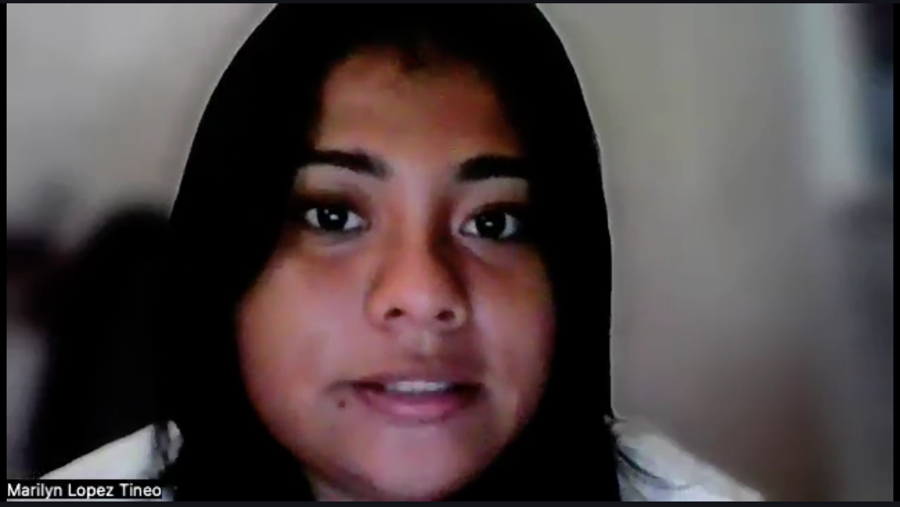

Marilyn, una joven residente de Tarapoto, nos cuenta que desde pequeño recuerda cómo llega y recibe el agua a su hogar a travez de una pileta ubicada a unas cuantas cuadras de su vivienda. Tambien comenta que en su distrito estan desarrollando un proyecto en el cual aun no esta del todo completo y parece ser que pinta para el fracaso. Ademas que el agua que le llega a su hogar a veces esta en mal estado, sea por pequeñas particulas o este de otro color, siendo mas el marron. Ella estaria dispuesta a participar en el proyecto para ayudar a que el agua sea mas pura para el consumo y uso diario en su distrito.

**Entrevistas usuario segmento (Proveedor de agua)**

Nombre: Tracy Cordova
 
- Edad: 34
 
- Ocupación: Trabajadora de Sedapal
 
- Browser: Google Chrome
 
- Device: Teléfono Samsung
 
- Distrito: Jesus Maria
 
- Timing: 10:35
 
- Marca: Sunass
 

    

Tracy, trabajadora de Sedapal, explicó que uno de los principales retos en su labor es la falta de monitoreo en tiempo real, lo que retrasa la detección de problemas en la calidad del agua. Actualmente, el análisis de muestras puede demorar entre 3 y 7 días, dependiendo de la zona, lo cual limita la capacidad de respuesta.
Mencionó que usan herramientas básicas como hojas de cálculo y GIS, pero no cuentan con un sistema automatizado. Los costos logísticos son altos, especialmente en zonas rurales. Tracy considera que una solución IoT sería de gran ayuda, ya que permitiría detectar problemas al instante y proteger a la población. Sugiere incluir alertas automáticas, monitoreo constante y facilidad de uso.

Nombre: Kamila Panduro
 
- Edad: 20
 
- Ocupación: Trabajadora de Sedapal
 
- Browser: Google Chrome
 
- Device: Teléfono Samsung
 
- Distrito: Santiago de Surco
 
- Timing: 13:53
 
- Marca: Sunass
 

    

Kamila, trabajadora de una empresa proveedora de agua, señaló que los principales retos que enfrentan son la falta de equipos modernos, personal capacitado y los altos costos logísticos para llegar a zonas rurales. El proceso de análisis actual es lento, ya que deben recolectar muestras y enviarlas a laboratorios, lo que puede tomar varios días.
Indicó que utilizan principalmente hojas de cálculo y registros físicos, y en algunos casos herramientas como QGIS, pero no cuentan con un sistema digital integrado. Kamila considera que un sistema IoT sería clave para mejorar su trabajo, ya que permitiría una detección inmediata de problemas, reduciría costos y fortalecería la confianza de la comunidad. Sugiere que la solución incluya alertas automáticas, acceso a datos históricos y sensores que funcionen sin conexión constante.

Nombre: André Alonso Arroyo Ormeño
 
- Edad: 28
 
- Ocupación: Coordinador de monitoreo de calidad de agua
 
- Browser: Google Chrome
 
- Device: Samsung (móvil) / Acer (laptop)
 
- Distrito: Pueblo Nuevo, Chincha (Ica)

 

    
 

[Link de la entrevista](https://upcedupe-my.sharepoint.com/:v:/g/personal/u201719831_upc_edu_pe/ESHvuiS-1uxFoVubElY_50MB_Tk9hX2iy3uX2VsVH50gxA)

André, Coordinador de monitoreo de calidad de agua de 28 años que coordina el monitoreo en Pueblo Nuevo, comenta que sus mayores retos son la ausencia de datos en tiempo real, los tiempos muertos entre muestreo y resultados de laboratorio, y la dispersión de la información en planillas. Detalla que hoy el proceso incluye inspección en campo, mediciones rápidas in situ (cloro, pH, temperatura) y envío a laboratorio para análisis fisicoquímicos y microbiológicos; el control de cloro/pH es semanal o quincenal y el microbiológico mensual, con campañas extraordinarias ante incidentes. Le gustaría monitorear en tiempo real cloro, turbidez, pH, temperatura, conductividad, presión, caudal y nivel de tanque. Actualmente almacenan datos en Excel/Sheets y usan QGIS para mapas. Ante problemas, notifican, aíslan tramos, ajustan dosificación de cloro, purgan la red y activan abastecimiento alterno, informando a la comunidad. Los costos clave son transporte/viáticos, insumos y análisis de laboratorio. La detección puede darse en horas, pero la confirmación tarda 3–7 días. Considera que un sistema IoT permitiría alertas tempranas, mayor trazabilidad y transparencia, además de optimizar rutas y mantenimiento. Ve como imprescindibles alertas configurables, dashboard web/móvil con históricos, georreferenciación, modo offline/energía solar, gestión de roles y API para integrar con sistemas existentes.

### 2.2.3. Análisis de entrevistas
**Segmento 1: Habitantes**

**Estadísticas y Aspectos comunes:**
- Edades entre 20 y 34 años.
- Uso principal de teléfonos móviles (iPhone y Samsung).
- Navegadores más usados: Google Chrome.
- Procedencia de zonas urbanas marginales y rurales (Chincha Alta, Ica, Pueblo Libre).

**Características Objetivas:**
- Consumo de agua proveniente de camiones cisterna.
- Bajo acceso a información oficial sobre calidad del agua.
- Métodos caseros como hervir el agua para intentar garantizar su consumo.
- Uso activo de dispositivos móviles para la comunicación y búsqueda de información.

**Características Subjetivas:**
- Preocupación constante por la calidad del agua.
- Desconfianza hacia las fuentes oficiales de información sobre el estado del agua.
- Disposición a participar en iniciativas comunitarias que busquen mejorar el acceso y control del agua.
- Alta valoración de la transparencia y la información en tiempo real para mejorar su calidad de vida.

---

**Segmento 2: Proveedores**

**Estadísticas y Aspectos comunes:**
- Edad promedio de 24 años.
- Profesionales técnicos relacionados al sector hídrico.
- Uso de dispositivos móviles y laptops (Samsung, Acer).
- Trabajo basado en mediciones físicas y reportes manuales en zonas urbanas como SMP.

**Características Objetivas:**
- Dificultad para obtener datos rápidos sobre calidad del agua.
- Dependencia de procedimientos manuales y supervisión técnica tradicional.
- Costos logísticos relevantes asociados al monitoreo de agua (transporte, personal, tiempo).
- Uso de tecnologías básicas (correo, teléfono) para comunicación.

**Características Subjetivas:**
- Alta apertura a soluciones tecnológicas que agilicen la toma de decisiones.
- Reconocimiento de la necesidad de alertas en tiempo real sobre problemas de calidad del agua.
- Interés por optimizar procesos de medición y respuesta a través de tecnologías IoT.
- Valoración de herramientas que mejoren la eficiencia y reduzcan costos operativos.

### Datos Estadisticos

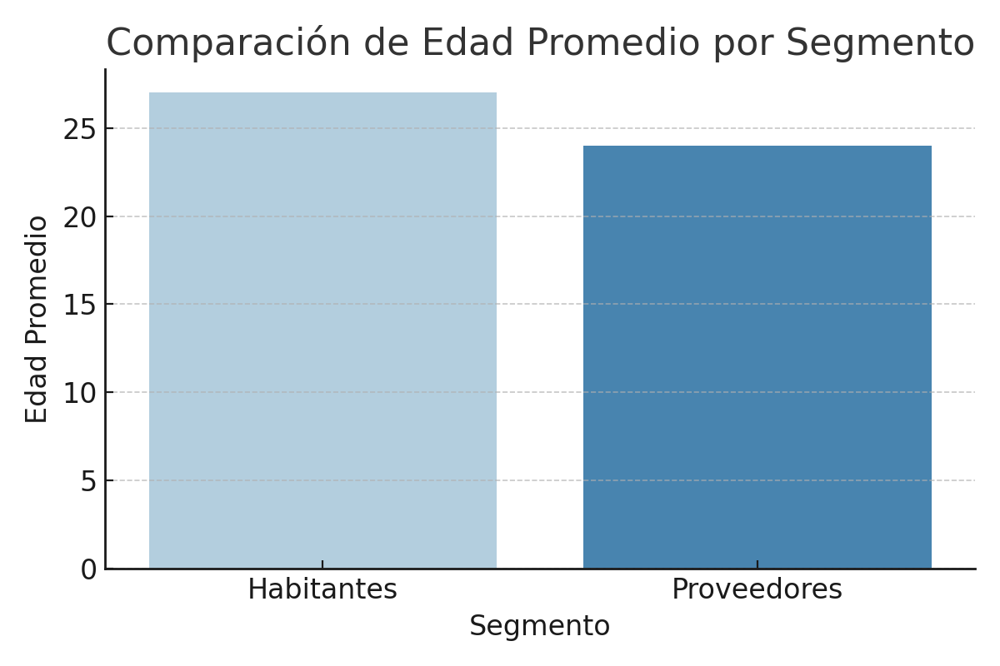

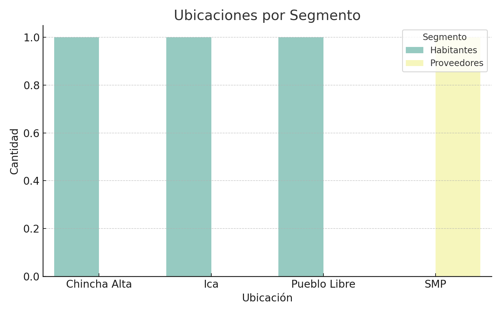

Los gráficos presentan datos relevantes sobre segmentos demográficos y su distribución geográfica. En la Comparación de Edad Promedio por Segmento, se observa que la edad promedio varía significativamente entre los segmentos analizados (habitantes y proveedores), con un rango de 0 a 25 años. Esto sugiere diferencias generacionales marcadas, donde un grupo podría ser notablemente más joven que el otro, lo que podría influir en patrones de consumo, necesidades de servicios o dinámicas laborales. Sin embargo, la falta de valores exactos limita una interpretación más precisa.

Por otro lado, el gráfico Ubicaciones por Segmento revela la distribución geográfica de habitantes y proveedores en localidades como Chincha Alta, Ica, Pueblo Libre y SMP. Las cantidades, representadas en una escala de 0.0 a 0.8, indican variaciones en la concentración de estos segmentos según la zona.

## 2.3. Needfinding

Para crear una solución que responda a las necesidades específicas de los usuarios, realizaremos la identificación del User persona, User Task Matrix, User Journey Maps, Empathy Mapping y As-is Scenario Mapping.

### 2.3.1. User Personas

Se han elaborado los User Persona correspondientes a cada uno de nuestros segmentos objetivos. Estos segmentos incluyen, por un lado, a los pobladores de zonas urbanas y rurales que enfrentan dificultades para acceder y gestionar un suministro de agua potable; y por otro lado, a los proveedores de agua. La construcción de estos perfiles se ha basado en los datos obtenidos a partir de las entrevistas realizadas. 

Los user persona nos permiten entender el perfil y comportamiento de cada segmento, ayudando a identificar sus necesidades técnicas y objetivos de forma general.

### Segmento 1: Habitantes

Presentamos a Mario López, un joven que reside en una zona urbana y enfrenta serias dificultades con el abastecimiento de agua. Este user persona representa a otro de nuestros segmentos objetivos, y fue creado a partir del análisis de problemáticas reales identificadas durante el proceso de entrevistas.

**Enlace para visualizar el User Persona de Habitantes realizado en UXPressia:**
[https://uxpressia.com/w/mDdvz/p/mIlB8](https://uxpressia.com/w/mDdvz/p/mIlB8)

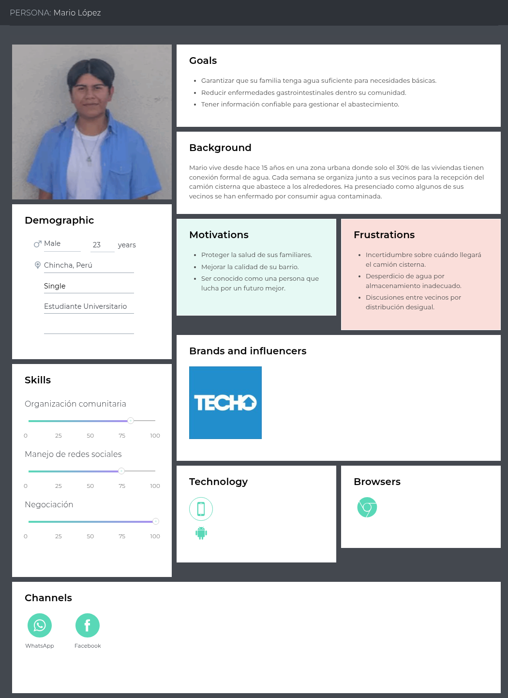

### Segmento 2: Proveedores

Presentamos a Gabriel Gonzales, un user persona construido a partir de la información recopilada durante las entrevistas. Gracias a este proceso, fue posible identificar sus habilidades, motivaciones, frustraciones, canales de comunicación, permitiendo así una comprensión más profunda del perfil correspondiente a uno de nuestros segmentos objetivos.

**Enlace para visualizar el User Persona de Proveedores realizado en UXPressia:** [https://uxpressia.com/w/mDdvz/p/SLYog](https://uxpressia.com/w/mDdvz/p/SLYog)

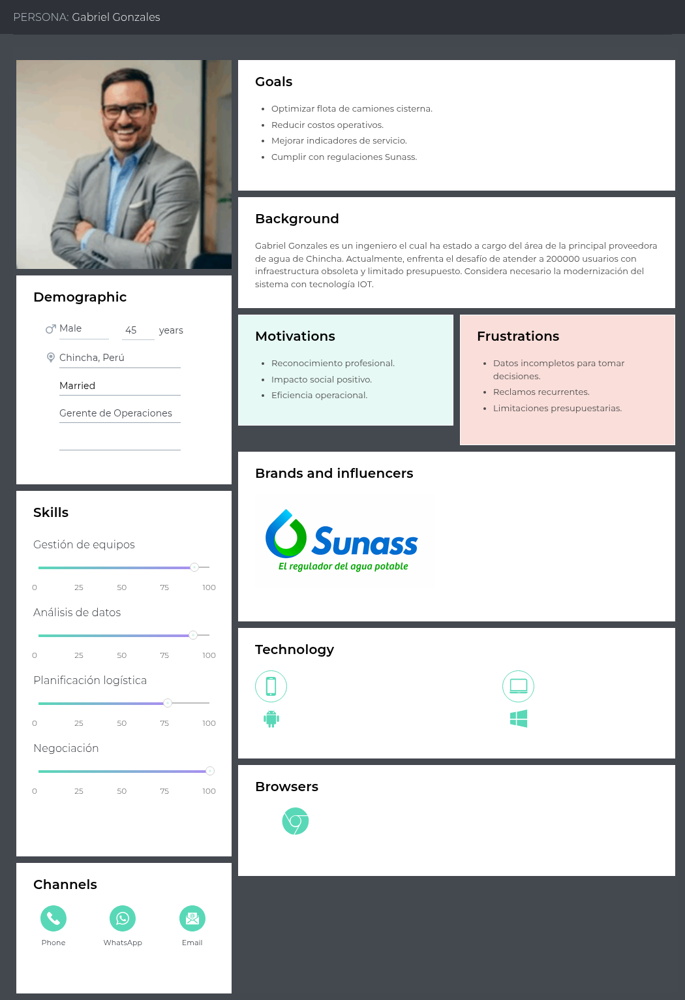

### 2.3.2. User Task Matrix
El user task matrix permite identificar y comparar los procesos clave de cada segmento, destacando sus similitudes en cuanto a frecuencia e importancia.

|**Necesidad / Función**|**Importancia (Habitantes)**|**Frecuencia (Habitantes)**|**Importancia (Proveedores de Agua)**|**Frecuencia (Proveedores de Agua)**|
| :- | :- | :- | :- | :- |
|Solicitar agua potable	|Alta|Alta|Alta|Alta|
|Coordinar horarios de entrega	|Alta|Alta|Alta|Alta|
|Verificar calidad del agua	|Alta|Media|Alta|Alta|
|Pagar por el servicio	|Alta|Media|Alta|Alta|
|Reportar problemas|Media|Media|Alta|Media|
|Planificar rutas de distribución	|Baja|Baja|Alta|Media|
|Gestionar inventario de agua disponible|Baja|Alta|Alta|
Media

|

En la matriz presentada, se pueden observar las siguientes tareas con mayor frecuencia e importancia:

- **Habitantes**:

  - **Solicitar agua potable y coordinar horarios de entrega**  
    Funcionalidad **más crítica**, con **alta importancia y frecuencia**. 
    Los habitantes necesitan un sistema confiable para pedir agua y conocer los horarios exactos de entrega, eliminando la incertidumbre actual.

  - **Verificar calidad del agua y pagar por el servicio**  
    Tareas de **alta importancia**pero **frecuencia media**.
    Requieren métodos sencillos para comprobar la calidad del agua y realizar pagos seguros.

  - **Reportar problemas**  
    De **importancia y frecuencia media**. No forman parte de su rutina diaria, por lo que pueden ofrecerse como funciones secundarias u opcionales.
    Necesitan un canal formal para reportar incidencias, con seguimiento garantizado.

- **Proveedores de Agua**:

  - **Verificar calidad del agua, gestionar inventario y planificar rutas**  
    Tareas **críticas y frecuentes**, esenciales esenciales para su operación diaria.
    Requieren herramientas para optimizar rutas, controlar inventarios en tiempo real y garantizar la calidad del servicio.

  - **Consultar historial de consumo y calidad** y **gestionar múltiples sensores IoT**  
    Funcionalidades con **alta importancia y frecuencia**.
    Necesitan un sistema integrado para gestionar pagos digitales y atender reportes de manera eficiente.

  - **Coordinar horarios de entrega**  
    Actividades de **alta importancia** y de **frecuencia alta**.
    

### 2.3.3. User Journey Mapping
El User Journey Mapping se desarrolló para comprender la experiencia de los usuarios al interactuar con nuestra plataforma. Este mapeo detalla cada paso que el usuario realiza, los obstáculos que puede encontrar, y las emociones que surgen en el proceso. Así, nos ayuda a identificar oportunidades para mejorar la usabilidad y satisfacción del usuario.

### Segmento 1: Habitantes

En este User Journey Map se muestra la experiencia actual del habitante responsable de gestionar el agua en su hogar. El proceso incluye la detección manual del nivel de agua, la solicitud de abastecimiento, la recepción y el almacenamiento. Identificamos problemas como la falta de precisión, comunicación ineficiente y riesgos de contaminación, lo que genera frustración e incertidumbre en el usuario.

**Enlace para visualizar el User Journey Map de Habitantes realizado en UXPressia:** [https://uxpressia.com/w/mDdvz/m/Q2oFD](https://uxpressia.com/w/mDdvz/m/Q2oFD)

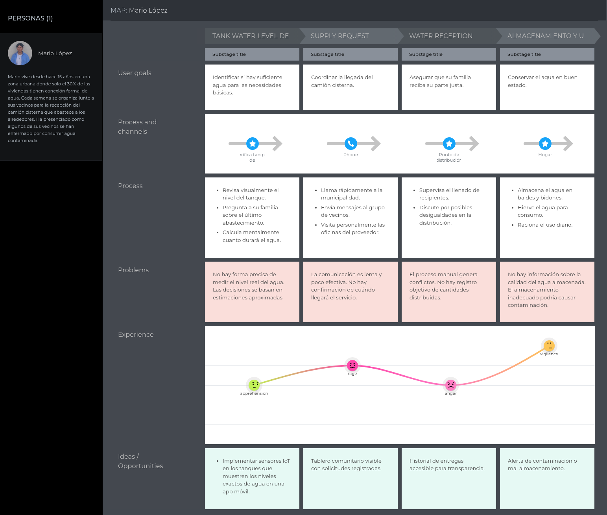

### Segmento 2: Proveedores

En este User Journey Map decribimos el recorrido actual del proveedor responsable de coordinar y supervisar la distribución de agua. Desde la planificación de rutas hasta la presentación de informes a las autoridades, el proveedor enfrenta limitaciones como la falta de información en tiempo real, baja eficiencia en la comunicación y poca visibilidad operativa. Estas dificultades afectan la toma de decisiones, el seguimiento de entregas y el cumplimiento con las normas.

**Enlace para visualizar el User Journey Map de Proveedores realizado en UXPressia:** 

[https://uxpressia.com/w/mDdvz/m/wtXHH](https://uxpressia.com/w/mDdvz/m/wtXHH)

### 2.3.4. Empathy Mapping

Para la creación del Empathy Map, hemos utilizado la información obtenida de nuestros dos User Personas que representan nuestro segmento objetivo. Este mapa nos permite profundizar en la comprensión de las necesidades, pensamientos, emociones y comportamientos de los usuarios, ayudándonos a diseñar soluciones más alineadas con sus expectativas y experiencias reales.

### Segmento 1: Habitantes
En el siguiente Empathy Map tenemos a Mario Lopez, un joven que vive en una zona urbana en Chincha. Él lucha diariamente por garantizar agua segura para su familia y su comunidad. Podemos observar su experencia, la cual refleja los desafíos de miles de personas que dependen de camiones cisterna.

**Enlace para visualizar el Empathy Map de Proveedores realizado en UXPressia:**
[https://uxpressia.com/w/mDdvz/p/ZQOfG](https://uxpressia.com/w/mDdvz/p/ZQOfG) 
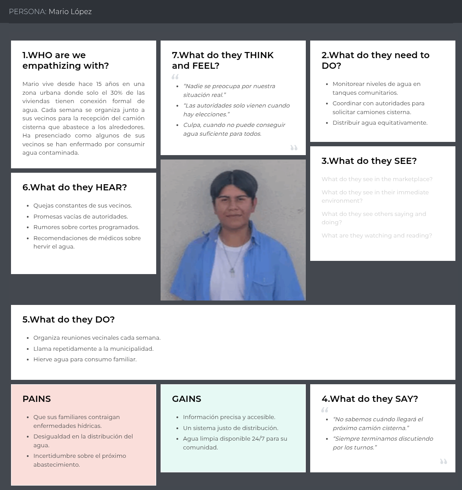

### Segmento 2: Proveedores
En el siguiente Empathy Map observamos la perspectiva de Gabriel Gonzales, encargado del
área principal de la proveedora de agua más grande Chincha. Dentro de su perfil podemos observar los desafíos sa los que se enfrenta como gestionar de recursos limitados mientrasse cumplen regulaciones estrictas y demandas de usuarios insatisfechos.

**Enlace para visualizar el Empathy Map de Proveedores realizado en UXPressia:**
[https://uxpressia.com/w/mDdvz/p/wA0jm](https://uxpressia.com/w/mDdvz/p/wA0jm) 
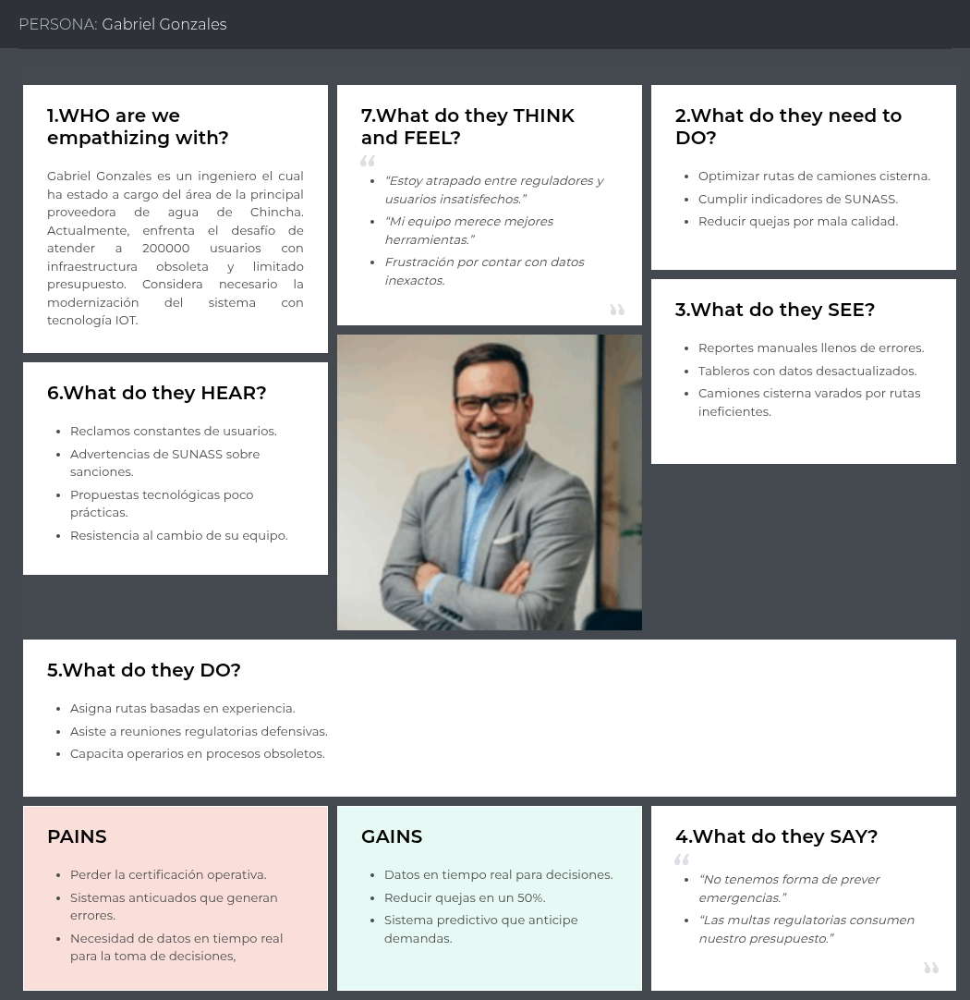

### 2.3.5. As-is Scenario Mapping

Aquí tenemos el As-Is Scenario para el segmento de habitantes, que contiene un proceso donde los pedidos se realizan por llamadas o mensajes sin confirmación inmediata, las entregas se coordinan verbalmente sin horarios fijos, los pagos son en efectivo sin comprobantes, no se verifica la calidad del agua y no existe un sistema formal de seguimiento o quejas.
### Segmento 1: Habitantes
**Enlace para visualizar el As-is Scenario Map de Proveedores realizado en Miro:** 
[https://miro.com/app/board/uXjVMhdPpY8=/?share_link_id=712775907835](https://miro.com/app/board/uXjVMhdPpY8=/?share_link_id=712775907835)

**Brainstorming:**

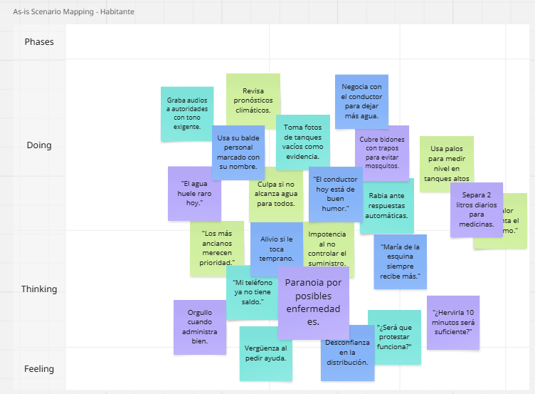

**Identify the highs and lows:**

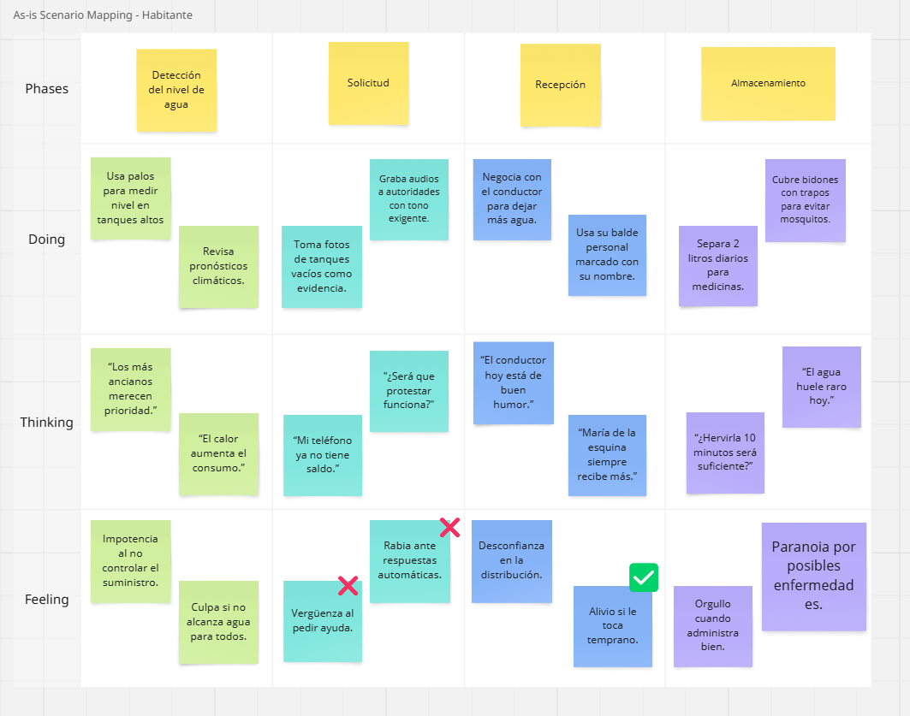

**Positive Areas:**
* Alivio si le toca temprano.

**Negative Areas:**
* Rabia ante respuestas automáticas.
* Vergüenza al pedir ayuda.

**Blank Areas:**
* Podría ser útil explorar cómo es el flujo de la comunicación al solicitar agua.

Tenemos el As-Is Scenario para el segmento de proveedores, que contiene una operación desorganizada donde la gestión de pedidos se hace en libretas o por mensajes, las rutas se planifican manualmente, los cobros son en efectivo sin registros digitales, no hay control de inventario ni historial de entregas, y no pueden demostrar la calidad del agua que distribuyen.

### Segmento 2: Proveedores
**Enlace para visualizar el As-is Scenario Map de Proveedores realizado en Miro:** 
[https://miro.com/app/board/uXjVMhdPpY8=/?share_link_id=712775907835](https://miro.com/app/board/uXjVMhdPpY8=/?share_link_id=712775907835)

**Brainstorming:**

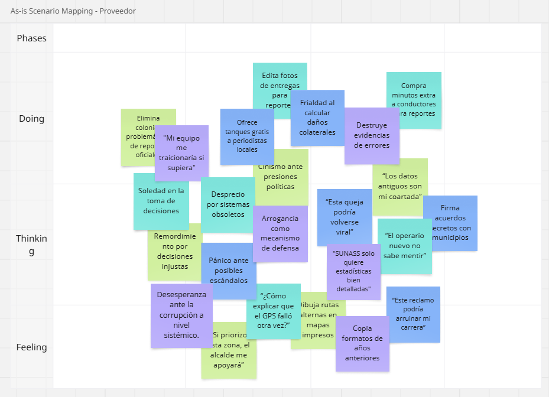

**Identify the highs and lows:**

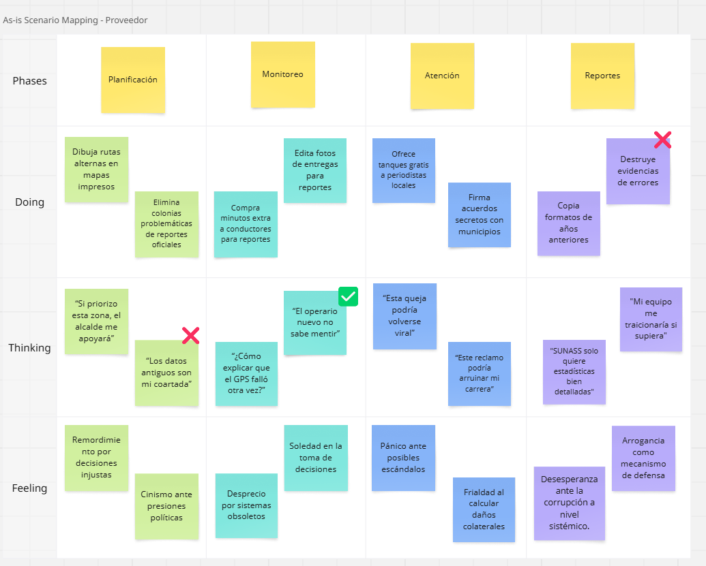

**Positive Areas:**
* ***"El operario nuevo no sabe mentir"*** (esto nos indica tranparecia en su trabajo).

**Negative Areas:**
* Destruye evidencias de errores.
* ***"Los datos antiguos son mi coartada"***

**Blank Areas:**
* Profundizar en la carga emocional que conlleva manipular reportes.

## 2.4. Ubiquitous Languange
| **Term**                             | **Definition** |
|--------------------------------------|----------------|
| **Resident**                       | End user who consumes water at home and uses the platform to stay informed about service quality, water level, and alerts. |
| **Provider**                   | Entity responsible for monitoring, managing, and distributing water in a community or locality. |
| **IoT Sensor**                       | Device installed at strategic points that measures parameters such as water level, quality, or pressure in real time. |
| **Water Quality**                    | Value indicating whether the water is safe for consumption, based on chemical, physical, and biological parameters. |
| **Water Level**                      | Height of stored or distributed water, measured by sensors to anticipate shortages or overflows. |
| **Alert**                            | Automatic notification sent to users when a low level or unsafe water is detected. |
| **Consumption and Quality History**  | Record of water levels and quality over time, useful for analysis and monitoring. |
| **Report**                           | Automatically generated document with historical data, alerts, consumption, and water conditions. |
| **Dashboard**                        | Customized view (for inhabitants or providers) displaying relevant data, graphs, and alerts. |
| **Water Distribution**               | Logistical and technical process through which water is delivered from its source to households. |
| **Distribution Impact**             | Measurement of how system conditions (leaks, pressure, high consumption) affect distribution efficiency. |
| **Web Platform/Mobile App**          | Digital interface accessible via computer or smartphone where users view and manage water service information. |
| **Device Monitoring**                | Functionality that allows providers to configure, monitor, or troubleshoot installed IoT sensors. |
| **Real-Time Visualization**          | Dynamic and continuous display of current data about the water system. |
| **Registered Users**                 | People with authenticated access to the platform, either inhabitants or providers, with differentiated functionalities. |
| **Coverage Area**                    | Geographic area where AquaConecta provides services and where sensors are located. |

# Capítulo III: Introducción

## 3.1. To-Be Scenario Mapping

En esta sección se describe cómo serían los escenarios ideales (To-Be) una vez implementada la solución propuesta por nuestro equipo. A partir de los mismos escenarios utilizados en el análisis As-Is, se plantea una visión futura optimizada, en la que los problemas identificados han sido resueltos o mitigados gracias a nuestra intervención.

Cada mapeo To-Be representa la experiencia del usuario mejorada, los escenarios están divididos por segmentos para mantener un enfoque claro y específico.

### Segmento 1: Habitantes 

Enlace para visualizar el As-is Scenario Map de Habitantes realizado en Miro: https://miro.com/app/board/uXjVIBKpWJQ=/?share_link_id=18556028670 

### Brainstorming:

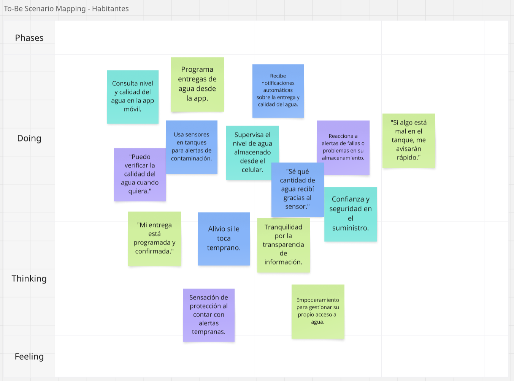

### To-Be Scenario Mapping 

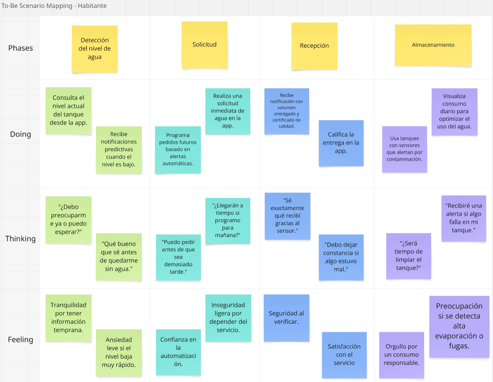

### Segmento 2: Proveedores

Enlace para visualizar el As-is Scenario Map de Proveedores realizado en Miro: https://miro.com/app/board/uXjVIBKpWJQ=/?share_link_id=18556028670

### Brainstorming:

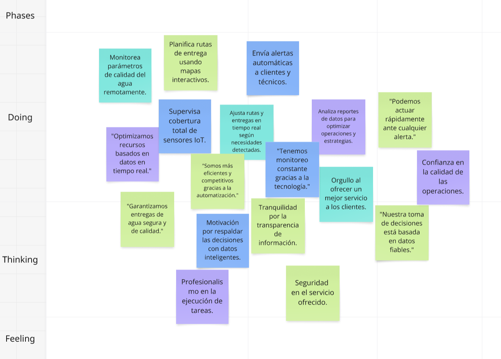

### To-Be Scenario Mapping 

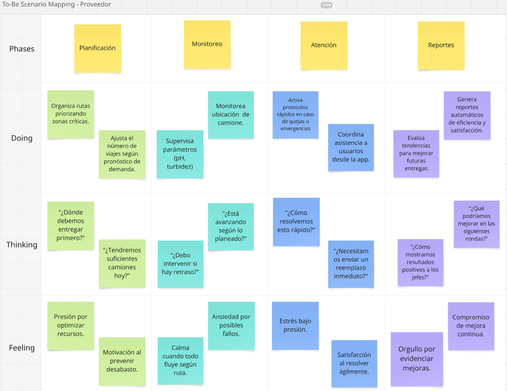

## 3.2. User Stories

El apartado de User Stories permite identificar las diversas situaciones que experimenta el usuario al interactuar con las diferentes áreas del proyecto, desde la página de inicio de sesión hasta las funcionalidades técnicas implementadas por el equipo de desarrollo. Su relevancia radica en que facilita la creación de un product backlog y, mediante los criterios de aceptación, podemos comprobar si estas historias se han cumplido correctamente.

**Epics y User Stories de AquaConecta**

|**Epic / Story ID**|**Título**|**Descripción**|**Criterios de Aceptación**|**Relacionado con (Epic ID)**|
| - | - | - | - | - |
|**EP01**|**Dashboard and Analytics**|
**Como** usuario,

**Quiero** visualizar métricas de los sensores

**Para** garantizar un seguimiento continuo de mis tanques de agua.
|||
|**HU01**|**Ver nivel actual del agua de los habitantes**|
**Como** proveedor, 

**Quiero** visualizar el nivel actual del agua de un habitante 

**Para** conocer la cantidad disponible.
|
**Escenario 1: Vista general de todos los clientes** **Dado** que el proveedor accede al dashboard de métricas, **Cuando** visualiza la pantalla principal, **Entonces** el sistema muestra el número total de clientes activos, consumo promedio y alertas pendientes.

**Escenario 2: Ver detalles por cliente Dado** que el proveedor ver la información de residente, **Cuando** selecciona un residente en específico, **Entonces** el sistema muestra las métricas agrupadas por esa zona.
|**EP01**|
|**HU02**|**Ver métricas de del tanque de agua**|
**Como** habitante, 

**Quiero** visualizar el resumen de métricas de mi tanque

**Para** conocer la cantidad disponible y solicitar el reabastecimiento correspondiente.
|
**Escenario 1: El sistema muestra correctamente la distancia medida Dado** que el tanque tiene agua y el sensor funciona correctamente, **Cuando** el sistema mide el nivel de agua, **Entonces** la información se procesa y se registra para mostrar cuántos centímetros de agua hay disponibles.

**Escenario 2: Vista resumen móvil Dado** que el habitante accede desde su dispositivo móvil, **Cuando** ingresa a la pantalla principal, **Entonces** el sistema muestra un resumen con consumo actual, promedio del mes y nivel del tanque.

**Escenario 3: Notificaciones de métricas Dado** que el habitante tiene habilitadas las notificaciones, **Cuando** su consumo es total **Entonces** recibe una notificación con el resumen del consumo.
|**EP01**|
|**HU03**|
**Ver calidad del agua**

|
**Como** habitante, 

**Quiero** que el sistema mida la calidad del agua, 

**Para** saber si es segura para el consumo de mi familia.
|
**Escenario 1: Lectura de TDS exitosa Dado** que el sensor de calidad está funcionando  **Cuando** se mide el nivel de sólidos disueltos (TDS), **Entonces** el sistema calcula el valor en ppm y lo clasifica como excelente, buena, aceptable, mala, no potable o contaminada.

**Escenario 2: El sistema informa cuando el agua no es apta Dado** que el valor de TDS supera los 600 ppm, **Cuando** se realiza la medición, **Entonces** el sistema muestra una advertencia indicando que el agua no debe consumirse.
|**EP01**|
|
**HU04**
|**Recibir datos actualizados constantemente**|
**Como** habitante,

**Quiero** que el sistema realice lecturas frecuentes del agua,

**Para** asegurarme de que la información sobre el nivel y la calidad esté siempre actualizada
|**Escenario 1: Lectura automática cada segundo Dado** que el sistema está encendido, **Cuando** pasa un segundo, **Entonces** se ejecutan nuevas mediciones de nivel y calidad de agua sin que el usuario tenga que hacer nada.  
**Escenario 2: Reintento ante fallo de lectura Dado** que el sistema intenta actualizar los datos automáticamente,  **Cuando** una lectura falla por pérdida de conexión o error del sensor,  **Entonces** el sistema reintenta la actualización en el siguiente ciclo y muestra un mensaje de advertencia si el problema persiste.
|**EP01**|
|**EP02**|**Profile and Preferences**|
**Como** proveedor,

**Quiero** observar información detallada de mi empresa,

**Para** tomar decisiones informadas sobre el sistema
|||
|**HU05**|**Historial de alertas**|
**Como** proveedor,

**Quiero** ver una lista con todos reportes de los problemas que han tenido mis clientes, 

**Para** tener un registro del problema y poder solucionarlo lo antes posible.
|**Escenario 1: Visualizar la sección de reportes** **Dado** que el proveedor se encuentra en la página principal del sistema,  **Cuando** se dirige a la sección de reporte de problemas,  **Entonces** el sistema muestra la lista de los reportes generados por los clientes del proveedor con el nombre del residente, titulo del reporte, fecha de emisión y estado del reporte.  
**Escenario 2: Visualizar detalles del reporte** **Dado** que el proveedor visualiza su lista de reportes por cliente,  **Cuando** seleciona un reporte que requiere atención inmediata,  **Entonces** el sistema muestra detalles adicionales como descripción del problem.
 
**Escenario 3: Atender reporte generado por cliente** **Dado** que el proveedor visualiza los datos adicionales de un reporte ,  **Cuando** selecciona el botón de status,  **Y** lo actualiza dependiendo del estado en el que se encuentra el reporte,  **Entonces** el sistema actualiza el estado del reporte para el habitante.
|**EP02**|
|
**HU06**
|**Gestionar solicitudes de agua de residentes**|
**Como** proveedor, 

**Quiero** visualizar y gestionar las solicitudes de agua de mis residentes,

**Para** atender eficientemente las necesidades de suministro de agua de mi comunidad.
|
**Escenario 1: Visualización de solicitudes de agua Dado que** eel proveedor accede a la sección de solicitudes de agua **Cuando** navega a sus Peticiones de Agua,  **Entonces** puede ver una lista de todas las solicitudes de agua registradas,  **Y** se visualiza el estado actual de cada solicitud.

**Escenario 2: Revisión de detalles de solicitud específica** **Dado que** proveedor está viendo la lista de solicitudes **Cuando** selecciona una solicitud especifica,  **Entonces** el sistema le da acceso a los detalles completos de la solicitud

**Escenario 3: : Actualización de fecha de entrega de agua** **Dado que** el proveedor está revisando una solicitud de agua, **Cuando** selecciona una nueva fecha de entrega,  **Y** confirma la actualización,  **Entonces** el sistema actualiza la fecha de entrega programada
|**EP02**|
|
**HU07**
|**Visualizar suscripciones activas del proveedor**|
**Como** proveedor, 

**Quiero** ver todas las suscripciones de usuarios activas

**Para** tener un registro de todos mis usuarios/habitantes activos
|
**Escenario 1: Visualización de información detallada Dado que** el proveedor** visualiza su información detallada **Cuando** accede a su perfil de usuario **Entonces** el sistema muestra todos sus datos registrados como nombre, email, RUC.

**Escenario 2: Visualización de suscripciones activas** **Dado que** el proveedor visualiza la informacion de su cuenta,  **Cuando** ingresa a la seccion de sus suscripciones  **Entonces** se muestra el número de suscripciones activas
|**EP02**|
|**EP03**|**Landing Page** |**Como** usuario interesado en soluciones de acceso a agua, **Quiero** navegar por una página clara, informativa y responsiva,                  **Para** comprender los beneficios de Aqua Conecta, explorar planes y contactar al equipo fácilmente.|||
|**HU08**|**Presentación clara de beneficios de valor**|**Como** visitante del sitio web, **Quiero** visualizar claramente los beneficios de la plataforma Aqua Conecta, **Para** entender cómo puede mejorar el acceso y control del agua en mi comunidad.|
**Escenario 1: Visualización de información importante de AquaConecta Dado** que el visitante accede a la landing page desde cualquier dispositivo,                               **Cuando** navega hacia la sección “¿Por qué elegir Aqua Conecta?”,                    **Entonces** visualiza un mensaje informativo sobre AquaConecta.

**Escenario 2:  Visualizar beneficios principales Dado** que el visitante quiere conocer sobre los beneficios, **Cuando** sigue en la sección de beneficios **Entonces** visualiza una lista detallada de todos los beneficios que se ofrecen
|**EP03**|
|**HU09**|**Información sobre segmentación de perfiles de usuario**|
**Como** usuario potencial**,**

**Quiero** identificar si la solución Aqua Conecta está dirigida a mi tipo de necesidad

**Para** saber si puedo beneficiarme directamente de sus servicios.
|
**Escenario 1: Comprensión de públicos objetivos para habitantes Dado** que un visitante desea saber si la solución se alinea con sus necesidades, **Cuando** accede a la sección “A quiénes queremos ayudar”, **Entonces** puede leer y diferenciar los beneficios específicos para el segmento de habitantes.

**Escenario 2: Comprensión de públicos objetivos para proveedores Dado** que un visitante desea saber si la solución se alinea con sus necesidades, **Cuando** accede a la sección “A quiénes queremos ayudar”, **Entonces** puede leer y diferenciar los beneficios específicos para el segmento de proveedores.

|**EP03**|
|**HU10**|**Comunicación del problema y la solución**|
**Como** visitante interesado,

**Quiero** entender el contexto del problema del acceso al agua y cómo AquaConecta lo resuelve,

**Para** evaluar el valor real que la solución puede aportar a mi comunidad o negocio.
|
**Escenario 1: Explicación clara sobre el desafío actual Dado** que un visitante necesita entender el contexto de la crisis de agua, **Cuando** llega a la sección “La problemática del agua”, **Entonces** visualiza información y porcentajes sobre la problemática que está abordando.

**Escenario 2: Explicación clara sobre la solución Dado** que un visitante necesita conocer en qué consiste la solución, **Cuando** llega a la sección “Nuestra Solución”, **Entonces** visualiza información sobre la implementación de la solución.
|**EP03**|
|**HU11**|**Comparación de planes y acciones de compra**|
**Como** visitante interesado en adquirir un servicio,

**Quiero** revisar los planes, precios y características de AquaConecta,

**Para** decidir si deseo solicitar un plan o contactar por asesoría.
|
**Escenario 1: Visualización de planes y precios Dado** que un visitante desea conocer los planes disponibles, **Cuando** navega a la sección “Nuestros Servicios”**, Entonces** puede ver los planes disponibles, su precio y características, con opción para solicitar o agendar.

**Escenario 2: Visualización de servicios Dado** que un visitante desea conocer los servicios disponibles, **Cuando** navega a la sección “Nuestros Servicios”**, Entonces** puede ver los servicios disponibles con su información.
|**EP03**|
|**HU12**|**Envío efectivo de consultas por formulario**|
**Como** usuario con preguntas o interés en Aqua Conecta,

**Quiero** poder llenar y enviar un formulario de contacto,

**Para** recibir asistencia, cotización o más información directamente del equipo**.**
|
**Escenario 1: Visualización del formulario de contacto Dado** que un visitante tiene preguntas o desea más información, **Cuando** se dirige a la sección “Contacta con nosotros”, **Entonces** puede visualizar todas las secciones del formulario de contacto.

**Escenario 2: Envío de formulario de contacto Cuando** un visitante quiere enviar su información de contacto **Cuando** completa el formulario **Entonces** se le enviaran todos los datos de contacto.
|**EP03**|
|**EP04**|**Identity and Access Management**|
**Como** usuario de la plataforma,

**Quiero** poder crear una cuenta, iniciar sesión y gestionar mi información personal, 

**Para** acceder a los servicios del sistema de forma segura y personalizada.
|||
|**HU13**|**Registro de usuario Web**|
**Como** proveedor,

**Quiero** registrarme desde la plataforma web ingresando mis datos,

**Para** crear una cuenta y comenzar a gestionar mis servicios.
|
**Escenario 1: Registro completo desde el sitio web Dado** que el usuario está en el formulario de registro **Cuando** completa sus datos correctamente **Entonces** se crea su cuenta y es redirigido al login.

**Escenario 2: Validación de campos vacíos Dado** que el usuario no completa todos los campos requeridos **Cuando** intenta registrar los datos **Entonces** el sistema muestra mensajes de validación en los campos incompletos
|**EP04**|
|**HU14**|**Inicio de sesión de usuario móvil**|
**Como** habitante,

**Quiero** iniciar sesión desde la aplicación móvil,

**Para** acceder a mi cuenta y monitorear el estado del agua en mi hogar.
|
**Escenario 1: Inicio de sesión exitoso Dado** que el usuario ingresa sus credenciales válidas en la aplicación **Cuando** se encuentra en la sección de login **Entonces** el sistema valida los datos y redirígeme al panel principal 

**Escenario 2: Contraseña Incorrecta Dado** que el usuario ingresa un nombre de usuario correcto pero contraseña incorrecta **Cuando** intenta iniciar sesión **Entonces** el sistema muestra un mensaje de error
|**EP04**|
|**HU15**|**Inicio de sesión de usuario web.**|
**Como** proveedor,

**Quiero** ingresar a la plataforma web con mis credenciales,

**Para** gestionar mis servicios y usuarios asociados de forma segura.
|
**Escenario 1: Inicio de sesión exitoso Dado** que el usuario ingresa sus credenciales válidas en la aplicación **Cuando** se encuentra en la sección de login **Entonces** el sistema valida los datos y redirígeme a la lista de residentes.

**Escenario 2: Contraseña Incorrecta Dado** que el usuario ingresa un nombre de usuario correcto pero contraseña incorrecta **Cuando** intenta iniciar sesión **Entonces** el sistema muestra un mensaje de error.
|**EP04**|
|**HU16**|**Visualización y Edición del perfil de usuario móvil**|
**Como** habitante,

**Quiero** ver y editar mi información personal desde la aplicación móvil,

**Para** mantener mis datos actualizados fácilmente.
|
**Escenario 1: Acceso al perfil desde menú Dado** que el usuario accede al menú de la aplicación **Cuando** se dirige a la sección de perfil **Entonces** el sistema muestra su información personal actual

**Escenario 2: Edición exitosa de perfil Dado** que el usuario móvil accede a la pantalla de perfil **Cuando** accede a la edición de sus datos **Y** los actualiza **Entonces** el sistema confirma los cambios con un mensaje

**Escenario 3: Error por formato inválido Dado** que el usuario intenta ingresar un número de teléfono inválido **Cuando** intenta guardar los datos **Entonces** el sistema bloquea el envío y muestra un mensaje de error.
|**EP04**|
|**HU17**|**Visualización y Edición del perfil de usuario web**|
**Como** proveedor,

**Quiero** acceder y modificar mi perfil desde la plataforma web,

**Para** gestionar mis datos de contacto y empresa de manera segura.
|
**Escenario 1: Acceso al perfil desde la pantalla principal Dado** que el usuario accede a la pantalla principal de la web **Cuando** se dirige a la sección de perfil  **Entonces** el sistema muestra su información personal actual 

**Escenario 2: Edición exitosa de perfil Dado** que el usuario web accede a la pantalla de perfil **Cuando** accede a la edición de sus datos **Y** los actualiza **Entonces** el sistema confirma los cambios con un mensaje

**Escenario 3: Error por formato inválido Dado** que el usuario intenta ingresar un número de teléfono inválido **Cuando** intenta guardar los datos **Entonces** el sistema bloquea el envío y muestra un mensaje de error.
|**EP04**|
|**HT01**|**Registro de credenciales de acceso**|
**Como** desarrollador,

**Quiero** implementar un endpoint para registrar nuevas cuentas de usuario,

**Para** permitir el acceso inicial a la plataforma de forma segura.
|
**Escenario 1: Registro exitoso de usuario a través de la API Dado** que el endpoint "/api/v1/authentication/sign-up" está disponible   **Cuando** se envía una solicitud POST con un username y password válidos   **Entonces** se recibe una respuesta con estado 201   **Y** el cuerpo de la respuesta incluye los datos del nuevo usuario junto con un identificador único.

**Escenario 2: Credenciales inválidas Dado** que el endpoint "/api/v1/authentication/sign-up" está disponible   **Cuando** se envía una solicitud POST con un rol incorrecto **Entonces** se recibe una respuesta con estado 400.
|**EP04**|
|**HT02**|**Inicio de sesión de usuario a través de la API**|
**Como** desarrollador,

**Quiero** permitir que los usuarios inicien sesión mediante la API,

**Para** autenticar su identidad y generar tokens válidos de acceso.
|
**Escenario 1: Inicio de sesión exitoso  Dado** que el endpoint "/api/v1/authentication/sign-in" está disponible **Cuando** se envía una solicitud POST con un correo electrónico y contraseña válidos **Entonces** se recibe una respuesta con estado 200 **Y** el cuerpo de la respuesta incluye un token de autenticación válido y datos básicos del usuario.

**Escenario 2: Fallo al iniciar sesión con credenciales incorrectas Dado** que el endpoint "/api/v1/authentication/sign-in" está disponible **Cuando** se envía una solicitud POST con un correo electrónico o contraseña incorrectos **Entonces** se recibe una respuesta con estado 401 **Y** el cuerpo de la respuesta incluye el mensaje "Credenciales incorrectas".
|**EP04**|
|**HT03**|**Gestión de perfiles a través de la API**|
**Como** desarrollador,

**Quiero** permitir que los usuarios inicien sesión mediante la API,

**Para** autenticar su identidad y generar tokens válidos de acceso.
|
**Escenario 1: Inicio de sesión exitoso  Dado** que el endpoint "/api/v1/authentication/sign-in" está disponible **Cuando** se envía una solicitud POST con un correo electrónico y contraseña válidos **Entonces** se recibe una respuesta con estado 200 **Y** el cuerpo de la respuesta incluye un token de autenticación válido y datos básicos del usuario

**Escenario 2: Fallo al iniciar sesión con credenciales incorrectas Dado** que el endpoint "/api/v1/authentication/sign-in" está disponible **Cuando** se envía una solicitud POST con un correo electrónico o contraseña incorrectos **Entonces** se recibe una respuesta con estado 401 **Y** el cuerpo de la respuesta incluye el mensaje "Credenciales incorrectas".
|**EP04**|
|**EP05**|**Subscriptions and Payments**|
**Como** usuario del sistema,

**Quiero** gestionar y consultar suscripciones asociadas a sensores IoT,

**Para** asegurar un monitoreo adecuado de los dispositivos asignados a los residentes, con control de acceso y estado.

|||
|**HU18**|**Registrar un nuevo residente**|
**Como** proveedor, 

**Quiero** registrar un nuevo residente 

**Para** que se genere automáticamente una suscripción que incluya el sensor y habilite el monitoreo del servicio de agua.
|
**Escenario 1: Redirección al formulario de registro de residente Dado** que el proveedor está en la lista de residentes, **Cuando** se dirige a "Nuevo Residente", **Entonces** es llevado al formulario de registro que incluye información del residente y procesamiento de pago.

**Escenario 2: Activación de suscripción tras completar registro y pago Dado** que el proveedor completa los datos del residente en el formulario (nombre, apellido, documento, email, teléfono, dirección), **Y** el sistema de pago MercadoPago procesa exitosamente el monto de S/ 200.00, **Cuando** se confirma la transacción de pago, **Entonces** se muestra que la suscripción quedó activa y vinculada al sensor y al residente.
 
**Escenario 3: Manejo de error en el pago Dado** que el proveedor completa los datos del residente,  **Cuando** el procesamiento del pago falla o es rechazado, **Entonces** se muestra un mensaje de error específicon, **Y** no se crea el residente ni la suscripción.
||
|**HU19**|**Añadir una nueva suscripción a un residente ya registrado**|
**Como** proveedor, 

**Quiero** agregar una nueva suscripción a un residente ya registrado , 

**Para** que mi cliente pueda tener varios sensores asignados a sus tanques de agua.
|
**Escenario 1: Visualizar lista de residentes Dado** que el proveedor quiere buscar a un residente en especifico, **Cuando** se dirige a su lista de residentes, **Y** ingresa su nombre o id en la barra de búsqueda **Entonces** el sistema le muestra el residente que esta buscando.

**Escenario 2: Agregar una nueva suscripció Dado** que el proveedor encontró al residente, **Cuando** lo selecciona, **Y** agrega una nueva suscripción  **Entonces** el sistema le mostrar una ventana emergente donde se registra la cantidad de litro que tendrá el tanque.

**Escenario 3: Finalizar pago de nueva suscripción Dado** que el proveedor ingreso el tamaño de almacenamiento del tanque, **Cuando** confirma el pago, **Entonces** el sistema muestra un mensaje de confirmación.
||
|**HU20**|**Ver suscripciones activas por residente**|
**Como** proveedor, 

**Quiero** visualizar las suscripciones activas asociadas a los sensores de cada residente,

**Para** conocer el estado de monitoreo de mis habitantes.
|
**Escenario 1: Registro de nuevo sensor Dado** que el proveedor está revisando la información de sus sensores, **Cuando**decide agregar uno nuevo, **Entonces** es llevado al formulario para registrar la suscripción correspondiente.

**Escenario 2: Activación de suscripción tras pago exitoso Dado** que el proveedor completa los datos del sensor y realiza el pago, **Cuando** la transacción se confirma con éxito, **Entonces** se muestra que la suscripción quedó activa y vinculada al sensor y al residente.
||
|**HU21**|**Ver todas las suscripciones del sistema**|
**Como** administrador,

**Quiero** visualizar todas las suscripciones del sistema, 

**Para** supervisar el uso de la plataforma por parte de proveedores y residentes.

|
**Escenario 1: Visualización de todas las suscripciones del sistema Dado** que el administrador quiere revisar las suscripciones registradas, **Cuando** accede a la opción correspondiente, **Entonces** se muestra una lista con todas las suscripciones, incluyendo proveedor, residente, sensor y estado.

**Escenario 2: No hay suscripciones registradas Dado** que el administrador intenta revisar las suscripciones, **Cuando** no se encuentra ninguna registrada, **Entonces** se muestra un mensaje indicando que no existen registros disponibles.
||
|**HU22**|**Visualizar suscripción del residente**|
**Como residente,** 

**Quiero consultar el estado de mi suscripción** 

**Para saber si mi sensor está activo y en funcionamiento.**
|
**Escenario 1: Visualizar suscripción del residente Dado** que el residente inicia sesión, **Cuando** revisa la opción “Mi suscripción”, **Entonces** se muestra la información del sensor asociado y el estado actual de la suscripción (activa o inactiva).

**Escenario 2: Sin suscripción registrada Dado** que el residente no tiene ninguna suscripción activa, **Cuando** accede a “Mi suscripción”, **Entonces** se muestra un mensaje indicando que aún no tiene sensores registrados o suscritos.
||
|**HU23**|**Chatbot de asistencia inteligente**|
**Como residente,** 

**Quiero interactuar con un chatbot en la aplicación móvil para consultar el nivel de agua, estado de mi suscripción o solicitar reabastecimiento,** 

**Para obtener respuestas rápidas y asistencia sin necesidad de conocimientos técnicos ni navegación compleja en la app.**
|
**Escenario 1: Consulta de nivel de agua por chatbot Dado** que el residente abre el chatbot en la app móvil, **Cuando** escribe "¿Cuánto agua tengo en mi tanque?", **Entonces** el chatbot responde con el nivel de agua más reciente registrado por el sensor.

**Escenario 2: Solicitud de reabastecimiento por chatbot Dado** que el habitante interactúa con el chatbot, **Cuando** escribe "Necesito más agua" o selecciona la opción de solicitar reabastecimiento, **Entonces**el chatbot genera automáticamente una solicitud en el sistema y envía confirmación al usuario.
||
|**HU24**|**CPredicción de consumo y solicitud automática**|
**Como proveedor,** 

**Quiero que el sistema use un modelo de machine learning,** 

**Para predecir el consumo de agua de los residentes y generar solicitudes automáticas de reabastecimiento.**
|
**Escenario 1: Predicción de consumo en base a patrones históricos Dado** que el sistema ha almacenado al menos 30 días de datos de consumo de un residente, **Cuando** el modelo de ML procesa los patrones de consumo, **Entonces** predice con un margen de error máximo del 10% el nivel estimado de agua que tendrá el residente en los próximos 3 días.

**Escenario 2: Generación automática de solicitud de reabastecimiento Dado** que el modelo de ML predice que el nivel del tanque bajará de 20% en menos de 48 horas, **Cuando** el sistema valida la predicción, **Entonces** genera automáticamente una solicitud de reabastecimiento y la asigna al proveedor correspondiente.
||
|**HT04**|**Crear suscripción a través de API REST**|
**Como** desarrollador,

**Quiero** crear una suscripción a través de la API

**Para** que cada sensor quede vinculado a un residente y a un proveedor, y así se habilite el monitoreo.

|
**Escenario 1: Crear suscripción con datos válidos Dado** que el endpoint POST /subscriptions está disponible, **Cuando** se envía una solicitud con los valores sensorId, residentId y providerId, **Entonces** se responde con un código 201 Created, **Y** en el cuerpo de la respuesta se incluye el subscriptionId, la fechaInicio y el estado con valor ACTIVA.

**Escenario 2: Crear suscripción para un sensor ya suscrito Dado** que el endpoint POST /subscriptions está disponible, **Y** el sensor ya cuenta con una suscripción activa, **Cuando** se intenta crear otra suscripción usando el mismo sensorId, **Entonces** se responde con un código 409 Conflict, **Y** en el cuerpo se muestra el mensaje: "Ya existe una suscripción activa para este sensor."
||
|**HT05**|
**Obtener suscripciones por residente**

|
**Como** desarrollador, 

**Quiero** exponer un endpoint que permita obtener las suscripciones asociadas a un residente, 

**Para** que puedan ser consultadas fácilmente cuando se necesite.

|
**Escenario 1: Residente con suscripciones registradas Dado** que el endpoint GET /residents/{id}/subscriptions está disponible, **Cuando** se realiza una solicitud utilizando un residentId válido, **Entonces** se responde con un código 200 OK, **Y** el cuerpo de la respuesta incluye una lista de suscripciones, cada una con su sensorId, estado, fechaInicio y fechaFin.

**Escenario 2: Residente sin suscripciones Dado** que el endpoint GET /residents/{id}/subscriptions está disponible, **Cuando** se consulta a un residente que no tiene suscripciones registradas, **Entonces** se responde con un código 200 OK, **Y** el cuerpo de la respuesta contiene una lista vacía o un mensaje que indica que no hay suscripciones registradas.
||
|**HT06**|**Obtener todas las suscripciones del sistema**|
**Como** desarrollador,

**Q**uiero exponer un endpoint que permita listar todas las suscripciones registradas,** 

**Para** que el administrador pueda supervisar su uso y gestión.

|
**Escenario 1: Usuario con rol administrador accede al listado Dado** que el endpoint GET /subscriptions está disponible, **Cuando** un usuario autenticado con rol ADMIN realiza la solicitud, **Entonces** se responde con un código 200 OK, **Y** en el cuerpo se devuelve una lista de suscripciones que incluye la información del sensor, proveedor, residente y el estado de cada una.

**Escenario 2: Usuario sin permisos accede al listado Dado** que el endpoint GET /subscriptions está disponible, **Cuando** un usuario autenticado sin el rol ADMIN intenta acceder, **Entonces** se responde con un código 403 Forbidden, **Y** se incluye un mensaje que indica que no cuenta con los permisos necesarios para acceder a este recurso.
||

## 3.3. Impact Mapping

### Segmento 1: Habitantes

Para el segmento del usuario final se elaboró un Impact Mapping con el objetivo de aumentar la participación activa en la plataforma y reducir la incertidumbre sobre la calidad del agua. Esta herramienta nos permitió identificar los comportamientos clave que se desean promover en los usuarios, como consultar el estado del agua y configurar alertas personalizadas. A partir de ello, se definieron deliverables y user stories que guían el desarrollo de funcionalidades útiles y alineadas con las necesidades reales de los habitantes.
**Enlace para visualizar el Impact Map de Habitantes realizado en UXPressia:**
[https://uxpressia.com/w/mDdvz/i/0Fem9](https://uxpressia.com/w/mDdvz/i/0Fem9)

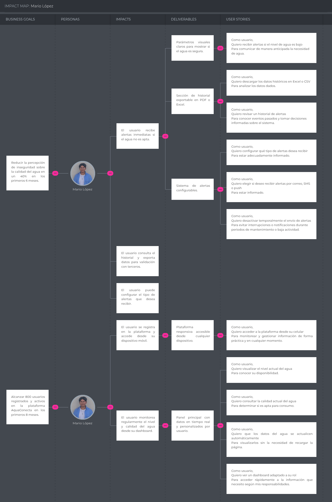

### Segmento 2: Proveedores

En el caso del proveedor, el Impact Mapping se enfocó en facilitar la gestión de sensores y la producción de reportes para la toma de decisiones. Gracias a ello se establecieron los impacts esperados, como registrar y monitorear sensores activos, así como generar estadísticas clave del sistema. Esto permitió definir deliverables específicos y user stories que aseguran un desarrollo enfocado en la eficiencia operativa y el control del servicio por parte del proveedor.
**Enlace para visualizar el Impact Map de Proveedores realizado en UXPressia:**
[https://uxpressia.com/w/mDdvz/i/Ue2yy](https://uxpressia.com/w/mDdvz/i/Ue2yy)

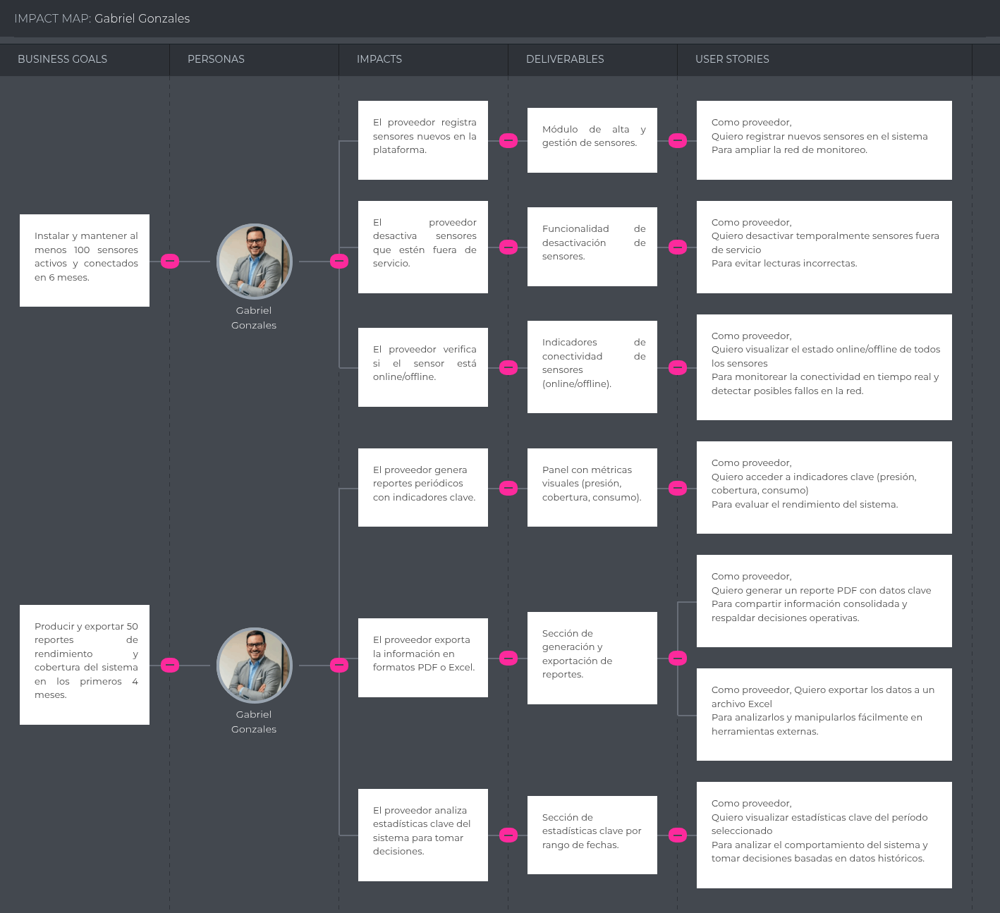

## 3.4. Product Backlog

El Product Backlog es una lista priorizada de tareas, funcionalidades y requisitos necesarios para el desarrollo del proyecto, asegurando que se trabaje en los elementos más importantes y alineados con los objetivos del proyecto. Cada ítem del backlog incluye una descripción, prioridad y título.

<table>
  <thead>
    <tr>
      <th>Orden</th>
      <th>User Story Id</th>
      <th>Título</th>
      <th>Descripción</th>
      <th>Story Points</th>
    </tr>
  </thead>
  <tbody>
    <tr>
      <td>1</td>
      <td>HU01</td>
      <td>Ver nivel actual del agua de los habitantes</td>
      <td>Como proveedor, quiero visualizar el nivel actual del agua de un habitante, para conocer la cantidad disponible.</td>
      <td>3</td>
    </tr>
    <tr>
      <td>2</td>
      <td>HU02</td>
      <td>Ver métricas del tanque de agua</td>
      <td>Como habitante, Quiero visualizar el resumen de métricas de mi tanque Para conocer la cantidad disponible y solicitar el reabastecimiento correspondiente.</td>
      <td>3</td>
    </tr>
    <tr>
      <td>3</td>
      <td>HU03</td>
      <td>Ver calidad del agua</td>
      <td>Como habitante, Quiero que el sistema mida la calidad del agua, Para saber si es segura para el consumo de mi familia.</td>
      <td>2</td>
    </tr>
    <tr>
      <td>4</td>
      <td>HU04</td>
      <td>Recibir datos actualizados constantemente</td>
      <td>Como habitante, Quiero que el sistema realice lecturas frecuentes del agua, Para asegurarme de que la información sobre el nivel y la calidad esté siempre actualizada.</td>
      <td>2</td>
    </tr>
    <tr>
      <td>5</td>
      <td>HU05</td>
      <td>Historial de problemas de habitantes</td>
      <td>Como proveedor, Quiero ver una lista con todos reportes de los problemas que han tenido mis clientes, Para tener un registro del problema y poder solucionarlo lo antes posible.</td>
      <td>2</td>
    </tr>
    <tr>
      <td>6</td>
      <td>HU06</td>
      <td>Gestionar solicitudes de agua de residentes</td>
      <td>Como proveedor, Quiero visualizar y gestionar las solicitudes de agua de mis residentes, Para atender eficientemente las necesidades de suministro de agua de mi comunidad.</td>
      <td>3</td>
    </tr>
    <tr>
      <td>7</td>
      <td>HU07</td>
      <td>Visualizar suscripciones activas del proveedor</td>
      <td>Como proveedor, Quiero ver todas las suscripciones de usuarios activas Para tener un registro de todos mis usuarios/habitantes activos.</td>
      <td>5</td>
    </tr>
    <tr>
      <td>8</td>
      <td>HU08</td>
      <td>Presentación clara de beneficios de valor</td>
      <td>Como visitante del sitio web, Quiero visualizar claramente los beneficios de la plataforma Aqua Conecta, Para entender cómo puede mejorar el acceso y control del agua en mi comunidad.</td>
      <td>2</td>
    </tr>
    <tr>
      <td>9</td>
      <td>HU09</td>
      <td>Información sobre segmentación de perfiles de usuario</td>
      <td>Como usuario potencial, Quiero identificar si la solución Aqua Conecta está dirigida a mi tipo de necesidad Para saber si puedo beneficiarme directamente de sus servicios.</td>
      <td>2</td>
    </tr>
    <tr>
      <td>10</td>
      <td>HU10</td>
      <td>Comunicación del problema y la solución</td>
      <td>Como visitante interesado, Quiero entender el contexto del problema del acceso al agua y cómo AquaConecta lo resuelve, Para evaluar el valor real que la solución puede aportar a mi comunidad o negocio.</td>
      <td>2</td>
    </tr>
    <tr>
      <td>11</td>
      <td>HU11</td>
      <td>Comparación de planes y acciones de compra</td>
      <td>Como visitante interesado en adquirir un servicio, Quiero revisar los planes, precios y características de AquaConecta, Para decidir si deseo solicitar un plan o contactar por asesoría.</td>
      <td>2</td>
    </tr>
    <tr>
      <td>12</td>
      <td>HU12</td>
      <td>Envío efectivo de consultas por formulario	</td>
      <td>Como usuario con preguntas o interés en Aqua Conecta, Quiero poder llenar y enviar un formulario de contacto, Para recibir asistencia, cotización o más información directamente del equipo.</td>
      <td>2</td>
    </tr>
    <tr>
      <td>13</td>
      <td>HU13</td>
      <td>Registro de usuario web</td>
      <td>Como proveedor, Quiero registrarme desde la plataforma web ingresando mis datos, Para crear una cuenta y comenzar a gestionar mis servicios.</td>
      <td>5</td>
    </tr>
    <tr>
      <td>14</td>
      <td>HU14</td>
      <td>Inicio de sesión de usuario móvil</td>
      <td>Como habitante, Quiero iniciar sesión desde la aplicación móvil, Para acceder a mi cuenta y monitorear el estado del agua en mi hogar.</td>
      <td>5</td>
    </tr>
    <tr>
      <td>15</td>
      <td>HU15</td>
      <td>Inicio de sesión web</td>
      <td>Como proveedor, Quiero ingresar a la plataforma web con mis credenciales, Para gestionar mis servicios y usuarios asociados de forma segura.</td>
      <td>5</td>
    </tr>
    <tr>
      <td>16</td>
      <td>HU16</td>
      <td>Visualización y edición de perfil móvil</td>
      <td>Como habitante, Quiero ver y editar mi información personal desde la aplicación móvil, Para mantener mis datos actualizados fácilmente.</td>
      <td>3</td>
    </tr>
    <tr>
      <td>17</td>
      <td>HU17</td>
      <td>Visualización y edición de perfil web</td>
      <td>Como proveedor, Quiero acceder y modificar mi perfil desde la plataforma web,Para gestionar mis datos de contacto y empresa de manera segura.
</td>
      <td>3</td>
    </tr>
    <tr>
      <td>18</td>
      <td>HU18</td>
      <td>Registrar nuevo residente</td>
      <td>Como proveedor, Quiero registrar un nuevo residente Para que se genere automáticamente una suscripción que incluya el sensor y habilite el monitoreo del servicio de agua.</td>
      <td>8</td>
    </tr>
    <tr>
      <td>19</td>
      <td>HU19</td>
      <td>Añadir una nueva suscripción a un residente ya registrado</td>
      <td>Como proveedor, Quiero agregar una nueva suscripción a un residente ya registrado , Para que mi cliente pueda tener varios sensores asignados a sus tanques de agua.
    </td>
      <td>5</td>
    </tr>
    <tr>
      <td>20</td>
      <td>HU20</td>
      <td>Ver suscripciones activas por residente</td>
      <td>Como proveedor, Quiero visualizar las suscripciones activas asociadas a los sensores de cada residente, Para conocer el estado de monitoreo de mis habitantes.</td>
      <td>5</td>
    </tr>
    <tr>
      <td>21</td>
      <td>HU21</td>
      <td> Ver todas las suscripciones del sistema	</td>
      <td>Como administrador, Quiero visualizar todas las suscripciones del sistema, Para supervisar el uso de la plataforma por parte de proveedores y residentes.</td>
      <td>3</td>
    </tr>
      <tr>
      <td>22</td>
      <td>HU22</td>
      <td>Visualizar suscripción del residente	</td>
      <td>Como residente, Quiero consultar el estado de mi suscripción Para saber si mi sensor está activo y en funcionamiento.</td>
      <td>2</td>
    </tr>
          <tr>
      <td>23</td>
      <td>HU23</td>
      <td>Chatbot de asistencia inteligente</td>
      <td>Como habitante,
Quiero interactuar con un chatbot en la aplicación móvil para consultar el nivel de agua, estado de mi suscripción o solicitar reabastecimiento,
Para obtener respuestas rápidas y asistencia en la app.</td>
      <td>5</td>
    </tr>
          <tr>
      <td>24</td>
      <td>HU24</td>
      <td>Predicción de consumo y solicitud automática</td>
      <td>Como proveedor,
Quiero que el sistema use un modelo de machine learning para predecir el consumo de agua de los residentes y generar solicitudes automáticas de reabastecimiento.</td>
      <td>8</td>
    </tr>
          <tr>
      <td>25</td>
      <td>HT01</td>
      <td>Registro de credenciales de acceso</td>
      <td>Como desarrollador, Quiero implementar un endpoint para registrar nuevas cuentas de usuario, Para permitir el acceso inicial a la plataforma de forma segura.</td>
      <td>5</td>
    </tr>
          <tr>
      <td>26</td>
      <td>HT02</td>
      <td>Inicio de sesión API</td>
      <td>Como desarrollador, Quiero permitir que los usuarios inicien sesión mediante la API, Para autenticar su identidad y generar tokens válidos de acceso.
</td>
      <td>5</td>
    </tr>
          <tr>
      <td>27</td>
      <td>HT03</td>
      <td>Gestión de perfiles vía API</td>
      <td>Como desarrollador, Quiero permitir que los usuarios inicien sesión mediante la API, Para autenticar su identidad y generar tokens válidos de acceso.
</td>
      <td>5</td>
    </tr>
          <tr>
      <td>28</td>
      <td>HT04</td>
      <td>Crear suscripción vía API REST</td>
      <td> Como desarrollador, Quiero crear una suscripción a través de la API Para que cada sensor quede vinculado a un residente y a un proveedor, y así se habilite el monitoreo
</td>
      <td>8</td>
    </tr>
              <tr>
      <td>29</td>
      <td>HT05</td>
      <td>Obtener suscripciones por residente</td>
      <td>Como desarrollador, Quiero exponer un endpoint que permita obtener las suscripciones asociadas a un residente, Para que puedan ser consultadas fácilmente cuando se necesite.
</td>
      <td>3</td>
    </tr>
              <tr>
      <td>30</td>
      <td>HT06</td>
      <td>Obtener todas las suscripciones del sistema</td>
      <td>Como desarrollador, Quiero exponer un endpoint que permita listar todas las suscripciones registradas, Para que el administrador pueda supervisar su uso y gestión.</td>
      <td>2</td>
    </tr>
  </tbody>
</table>

# Chapter IV: Solution Software Design

## 4.1. Strategic-Level Atrribute-Driven Desing

### 4.1.1. Design Purpose

El propósito del diseño arquitectónico del sistema AquaConecta es definir una solución tecnológica integral que soporte de manera robusta los procesos de monitoreo, gestión y distribución de agua potable en comunidades vulnerables. Dado que el sistema combina dispositivos físicos (sensores IoT en tanques domésticos) con aplicaciones digitales (plataforma web para proveedores y aplicación móvil para habitantes), la arquitectura debe responder a una serie de desafíos estratégicos:

- **Conectar el mundo físico con el digital**: Integrar los sensores IoT instalados en los tanques de agua de los habitantes con la nube y las aplicaciones cliente, asegurando que los datos sobre cantidad y calidad del agua se transmitan y procesen en tiempo real.

- **Soportar distintos perfiles de usuarios**: Diseñar un ecosistema donde proveedores de agua y habitantes puedan acceder a información confiable, cada uno con vistas y permisos específicos. Esto implica manejar autenticación segura, gestión de perfiles y trazabilidad de acciones.

- **Asegurar la sostenibilidad y escalabilidad**: La arquitectura debe ser lo suficientemente flexible para comenzar en un piloto acotado (Pueblo Nuevo, Chincha) y escalar gradualmente hacia más comunidades sin que el desempeño del sistema se degrade. Se busca garantizar que, a medida que se integren más sensores y usuarios, la infraestructura tecnológica pueda crecer horizontal y verticalmente.

- **Garantizar atributos de calidad críticos**:

  **Disponibilidad**: Que el sistema esté accesible incluso en entornos con conectividad limitada.

  **Seguridad**: Protección de datos sensibles de usuarios y de métricas ambientales.

  **Rendimiento**: Procesar datos en tiempo real sin retrasos que afecten la toma de decisiones.

  **Mantenibilidad**: Facilitar la incorporación de nuevas funcionalidades, como predicción de consumo mediante machine learning o integración con chatbots de soporte.

- **Apoyar la toma de decisiones basada en datos**: El diseño arquitectónico busca transformar datos crudos provenientes de los sensores en información visual, comprensible y accionable para habitantes y proveedores. Esto incluye reportes, alertas automáticas y dashboards que contribuyan a mejorar la eficiencia del servicio.

### 4.1.2. Attribute-Driven Design Inputs

#### 4.1.2.1 Primary Functionality (Primary User Stories)

El núcleo funcional de AquaConecta se centra en habilitar la trazabilidad y transparencia en el acceso al agua potable, tanto para los habitantes como para los proveedores. Se identifican como funcionalidades primarias las siguientes:

- **Monitoreo de agua en tiempo real (HU01, HU02, HU03, HU04)**:
Estas historias permiten que los habitantes visualicen el nivel de agua, métricas de su tanque y la calidad del recurso, mientras que los proveedores pueden conocer la disponibilidad de agua en cada vivienda. El objetivo es ofrecer información confiable y en tiempo real que guíe la toma de decisiones sobre consumo y distribución.

- **Gestión de solicitudes y problemas (HU05, HU06)**:
A través de estas funcionalidades, los proveedores reciben solicitudes de reabastecimiento y reportes de incidencias de los habitantes, lo que mejora la eficiencia operativa y la capacidad de respuesta ante situaciones críticas.

- **Gestión de suscripciones y residentes (HU18, HU19, HU20, HU22)**:
Estas historias aseguran que cada habitante esté vinculado a sensores activos en sus tanques mediante una suscripción gestionada por el proveedor. Permiten registrar nuevos residentes, añadir sensores adicionales y consultar el estado de la suscripción, garantizando un monitoreo continuo y confiable.

- **Funcionalidades emergentes de inteligencia artificial (HU23, HU24)**:
Estas historias representan la innovación central del sistema. El chatbot inteligente (HU23) permite a los habitantes interactuar fácilmente con la plataforma para consultar niveles de agua, estado de sus suscripciones o generar solicitudes, sin necesidad de conocimientos técnicos. Por su parte, la predicción de consumo y generación automática de solicitudes (HU24) habilita a los proveedores a optimizar la distribución anticipándose a la demanda, mediante modelos de machine learning que aprenden patrones de uso y reducen el riesgo de desabastecimiento.

En conjunto, estas historias de usuario constituyen la columna vertebral del sistema AquaConecta, ya que sin ellas no sería posible habilitar el servicio principal: el monitoreo y gestión inteligente del agua potable en comunidades con acceso limitado.

#### 4.1.2.2 Quality attribute Scenarios

#### Escenario 1: Disponibilidad en la consulta de datos

| **Campo** | **Descripción** |
|-----------|----------------|
| **ID** | QA-01 |
| **Atributo** | Disponibilidad |
| **Fuente** | Habitante |
| **Estímulo** | Consulta el nivel de agua en su aplicación móvil |
| **Artefacto** | Aplicación móvil – módulo de visualización de tanque |
| **Entorno** | Conectividad móvil limitada (3G/4G) |
| **Respuesta** | El sistema retorna el nivel de agua registrado más reciente, incluso si no hay conexión estable |
| **Medida** | Tiempo de respuesta < 3 segundos en el 99% de las consultas |

**Descripción:** Cada vez que un habitante consulta el estado de su tanque, el sistema debe mostrar de manera inmediata la última medición registrada, ya sea desde la nube o desde un caché local en el dispositivo. En caso de baja conectividad, la app debe funcionar en modo offline y sincronizar automáticamente los datos al restablecerse la red, garantizando que ninguna lectura se pierda o muestre valores desactualizados por más de 15 minutos.

#### Escenario 2: Seguridad en autenticación

| **Campo** | **Descripción** |
|-----------|----------------|
| **ID** | QA-02 |
| **Atributo** | Seguridad |
| **Fuente** | Proveedor |
| **Estímulo** | Intenta iniciar sesión desde la plataforma web |
| **Artefacto** | Módulo de autenticación web |
| **Entorno** | Usuario externo accediendo desde red pública |
| **Respuesta** | El sistema valida credenciales mediante autenticación segura y encripta la sesión |
| **Medida** | 100% de los datos transmitidos deben estar cifrados (TLS 1.2+) |

**Descripción:** Cada intento de inicio de sesión debe validar credenciales mediante un servidor seguro, con encriptación en tránsito (TLS 1.2+) y en reposo (AES-256). Si se detectan intentos de acceso no autorizados, el sistema debe registrar el evento y bloquear al usuario tras 5 intentos fallidos consecutivos. Además, todas las sesiones deben expirar automáticamente tras 15 minutos de inactividad para reducir riesgos de secuestro de sesión.

#### Escenario 3: Escalabilidad en la gestión de sensores

| **Campo** | **Descripción** |
|-----------|----------------|
| **ID** | QA-03 |
| **Atributo** | Escalabilidad |
| **Fuente** | Sistema (incremento en la red IoT) |
| **Estímulo** | Se duplican los sensores activos en la comunidad (de 500 a 1000) |
| **Artefacto** | API backend de recepción de datos IoT |
| **Entorno** | Operación normal con crecimiento de usuarios |
| **Respuesta** | El sistema procesa los datos sin pérdida ni retraso significativo |
| **Medida** | Latencia promedio de actualización < 5 segundos por sensor |

**Descripción:** Cuando se incremente el número de sensores conectados, el backend debe ser capaz de recibir y almacenar lecturas concurrentes en tiempo real sin pérdida de paquetes. Todas las nuevas mediciones deben reflejarse correctamente en los dashboards de proveedores y habitantes en un tiempo máximo de 5 segundos desde su recepción. Además, el sistema debe escalar horizontalmente con la incorporación de más instancias de procesamiento en la nube sin requerir interrupciones en el servicio.

#### Escenario 4: Confiabilidad ante desconexión de sensores

| **Campo** | **Descripción** |
|-----------|----------------|
| **ID** | QA-04 |
| **Atributo** | Confiabilidad |
| **Fuente** | Sensor IoT en tanque domiciliario |
| **Estímulo** | El sensor pierde conexión con el servidor central |
| **Artefacto** | Microcontrolador IoT con almacenamiento local |
| **Entorno** | Red inestable en zonas rurales |
| **Respuesta** | El sensor almacena temporalmente los datos y los envía cuando se restablece la conexión |
| **Medida** | Reintento automático con sincronización en un máximo de 5 minutos |

**Descripción:** Ante una pérdida de conectividad, el sensor debe continuar realizando mediciones locales en intervalos de 5 minutos y almacenarlas en memoria. Una vez reestablecida la conexión, el dispositivo debe transmitir de forma ordenada y sin pérdida todos los datos acumulados al servidor, asegurando consistencia en las gráficas de consumo. En ningún caso deben existir huecos en el historial de datos superiores a 10 minutos.

#### Escenario 5: Usabilidad en la interfaz de usuario

| **Campo** | **Descripción** |
|-----------|----------------|
| **ID** | QA-05 |
| **Atributo** | Usabilidad |
| **Fuente** | Habitante |
| **Estímulo** | Ingresa a la aplicación móvil para verificar el estado de su suscripción y tanque |
| **Artefacto** | Interfaz gráfica móvil |
| **Entorno** | Usuario con conocimientos básicos de tecnología |
| **Respuesta** | El sistema presenta el estado del agua y de la suscripción en máximo 3 pasos de navegación |
| **Medida** | 90% de los usuarios pueden completar la tarea sin necesidad de soporte |

**Descripción:** La aplicación debe mostrar en la pantalla principal el nivel actual de agua y el estado de la suscripción, con iconografía clara y colores diferenciados para estados críticos (ej. tanque vacío o sensor inactivo). Todas las interacciones deben requerir un máximo de 3 clics, y los textos deben estar redactados en un lenguaje sencillo. El diseño debe validarse mediante pruebas de usabilidad con al menos 10 habitantes del piloto, asegurando que la mayoría complete las tareas sin asistencia externa.

#### Escenario 6: Precisión en la predicción de consumo

| **Campo** | **Descripción** |
|-----------|----------------|
| **ID** | QA-06 |
| **Atributo** | Exactitud / Confiabilidad |
| **Fuente** | Proveedor del servicio de agua |
| **Estímulo** | El proveedor consulta las predicciones de consumo generadas por el modelo de machine learning. |
| **Artefacto** | Módulo de predicción de consumo (ML). |
| **Entorno** | El sistema cuenta con un histórico de al menos 30 días de datos de consumo de cada residente. |
| **Respuesta** | El modelo de ML calcula el consumo esperado para los próximos 3 días y actualiza el sistema con los valores proyectados. |
| **Medida** | El margen de error de las predicciones no debe superar el 10% respecto al consumo real registrado. |

**Descripción:** El sistema de predicción debe ser capaz de anticipar la demanda de agua de cada residente con una precisión suficiente para que los proveedores puedan planificar de forma eficiente las rutas de distribución. La exactitud del modelo se evalúa comparando los consumos reales con las predicciones realizadas, y el error aceptable es de hasta un 10%. Esto asegura que las solicitudes automáticas de reabastecimiento se generen de forma confiable, evitando tanto el desabastecimiento como los envíos innecesarios.

#### 4.1.2.3 Constraints

El diseño arquitectónico de AquaConecta se encuentra condicionado por un conjunto de restricciones que definen los límites técnicos, operativos y organizacionales dentro de los cuales debe desarrollarse la solución. A continuación, se detallan las principales restricciones identificadas.

**Restricciones Tecnológicas**:

- Hardware IoT: El sistema debe operar con microcontroladores de bajo costo (ej. ESP32/ESP8266) programados en C++, capaces de medir niveles y calidad del agua.

- Arquitectura IoT: Se debe incorporar un nodo Edge (raspberry pi u otro gateway ligero) que procese localmente los datos de los sensores. Este nodo realizará filtrado, agregación y envío diferido hacia la nube, garantizando resiliencia en entornos con conectividad limitada.

- Estilo arquitectónico backend: El backend debe implementarse bajo un monolito modular, con separación de capas (presentación, lógica de negocio y persistencia). Esta decisión se debe a que el equipo es reducido y se prioriza la simplicidad, mantenibilidad y menor costo de despliegue inicial frente a arquitecturas distribuidas más complejas.

- Aplicaciones cliente: Web desarrollada con Angular y móvil desarrollada con Flutter (Android/iOS).

- Infraestructura en la nube: Despliegue en servicios escalables tipo PaaS/IaaS (ej. AWS, GCP o Azure), con soporte para balanceo de carga y almacenamiento relacional/noSQL.

- Inteligencia artificial: La arquitectura debe integrar un motor de IA conversacional para soporte al usuario y un módulo de machine learning predictivo para anticipar patrones de consumo, ya sea alojados en la nube o en el edge, con capacidad de entrenar y actualizar modelos.

**Restricciones Operativas**:

- Conectividad limitada: El sistema debe garantizar operación en zonas rurales con acceso intermitente a internet, habilitando almacenamiento temporal en sensores y sincronización a través del edge node.

- Entorno geográfico: El piloto inicial está delimitado al asentamiento humano 28 de Julio en Pueblo Nuevo, Chincha, lo que condiciona la instalación y pruebas de campo a esa realidad local.

- Integración con actores externos: La plataforma debe ser capaz de interoperar con sistemas de municipalidades, EPS Semapach y ONGs mediante reportes exportables o servicios API.

- Mantenimiento en campo: Los sensores deben ser fáciles de instalar y reemplazar, con soporte remoto desde el edge node para actualizaciones de firmware.

- Disponibilidad de datos históricos: Para entrenar el modelo predictivo, el sistema debe garantizar el almacenamiento seguro y estructurado de al menos 30 días de datos de consumo antes de que el módulo ML pueda ser operativo.

**Restricciones Económicas y Organizacionales**:

- Financiamiento inicial limitado: El proyecto depende de alianzas con ONGs como AquaFund y Water.org, lo que obliga a priorizar hardware IoT de bajo costo y servicios cloud costo-eficientes.

- Implementación por fases: La arquitectura debe permitir un despliegue incremental (MVP → piloto → expansión regional) evitando reestructuraciones costosas.

- Recursos humanos: Dado el tamaño reducido del equipo, se prioriza el uso de frameworks maduros y librerías existentes sobre desarrollos personalizados.

- Capacitación de usuarios: Se deben considerar talleres o capacitaciones básicas para que los habitantes puedan interactuar fácilmente con el chatbot, especialmente en comunidades con baja alfabetización digital.

### 4.1.3. Architectural Design Backlog

| Prioridad | ID de Tarea | Tarea de Diseño Arquitectónico | Justificación | Atributos de Calidad Relacionados |
| :--- | :--- | :--- | :--- | :--- |
| **1** | ADB-01 | Definir el esquema de comunicación y almacenamiento de datos para operación offline | Esencial para garantizar la **disponibilidad** y **confiabilidad** en zonas con conectividad intermitente, lo cual es una restricción clave del proyecto. | Disponibilidad, Confiabilidad |
| **2** | ADB-02 | Diseñar el modelo de autenticación y autorización basado en roles | Crítico para la **seguridad** del sistema, protegiendo los datos de los residentes y asegurando que solo los proveedores autorizados gestionen la información. | Seguridad |
| **3** | ADB-03 | Estructurar la API REST del monolito modular para la ingesta de datos IoT | Fundamental para el **rendimiento** y la **escalabilidad**, permitiendo procesar datos de múltiples sensores en tiempo real sin degradar el servicio. | Rendimiento, Escalabilidad |
| **4** | ADB-04 | Diseñar la arquitectura del Edge Node para el procesamiento local de datos | Clave para mejorar el **rendimiento** y la **disponibilidad**, ya que reduce la latencia y la dependencia de la nube al filtrar y agregar datos en el borde de la red. | Rendimiento, Disponibilidad, Confiabilidad |
| **5** | ADB-05 | Definir la estrategia de despliegue en la nube (PaaS/IaaS) | Necesario para la **escalabilidad** y **mantenibilidad**, permitiendo un crecimiento flexible de la infraestructura y facilitando las actualizaciones. | Escalabilidad, Mantenibilidad |
| **6** | ADB-06 | Integrar el motor de IA conversacional y el módulo de Machine Learning | Importante para la **usabilidad** y la **funcionalidad avanzada**, diferenciando la solución al ofrecer soporte inteligente y predicciones de consumo. | Usabilidad, Confiabilidad |

### 4.1.4. Architectural Design Decisions

A continuación, se detallan las decisiones arquitectónicas clave tomadas para el desarrollo de AquaConecta, basadas en los requisitos funcionales, atributos de calidad y restricciones del proyecto.

#### 4.1.4.1. Adopción de un Monolito Modular con Separación de Capas

* **Decisión:** Se optó por una arquitectura de **monolito modular** para el backend en lugar de microservicios. La lógica de negocio estará organizada en módulos que se corresponden con los Bounded Contexts identificados (ej. `Monitoring`, `Subscriptions`, `Requests`). Internamente, cada módulo seguirá un patrón de capas (Presentación, Lógica de Negocio, Acceso a Datos).
* **Justificación:** Esta decisión responde a la restricción de un **equipo de desarrollo reducido** y la necesidad de una **implementación inicial rápida y de bajo costo**. Un monolito modular simplifica el despliegue, las pruebas y el mantenimiento en las primeras fases del proyecto. La modularidad interna permitirá una futura migración a microservicios si la escalabilidad lo requiere, mitigando el riesgo de un rediseño completo.
* **Alternativas Consideradas:** Se evaluó una arquitectura de microservicios, pero se descartó debido a la complejidad operativa (gestión de servicios, comunicación entre procesos, despliegue distribuido) y los costos iniciales más elevados, que no se justifican para la etapa de piloto del proyecto.

#### 4.1.4.2. Implementación de un Edge Node para Procesamiento de Datos IoT

* **Decisión:** Se implementará un **Edge Node** (utilizando un dispositivo como Raspberry Pi) que actuará como intermediario entre los sensores IoT y la nube. Este nodo será responsable de la agregación de datos, el filtrado de ruido y el almacenamiento temporal (caché) antes de enviar la información al backend.
* **Justificación:** Esta arquitectura responde directamente a la restricción de **conectividad limitada** en zonas rurales. El Edge Node garantiza la **confiabilidad** y **disponibilidad** del sistema, ya que los sensores pueden seguir operando y almacenando datos localmente incluso sin una conexión a Internet estable. Además, mejora el **rendimiento** al reducir la cantidad de datos brutos enviados a la nube.
* **Alternativas Consideradas:** Una conexión directa de los sensores a la nube (vía MQTT o HTTP) fue considerada. Sin embargo, esta opción fue descartada por su alta dependencia de la conectividad y el mayor riesgo de pérdida de datos en entornos inestables.

#### 4.1.4.3. Uso de Flutter para el Desarrollo de la Aplicación Móvil

* **Decisión:** La aplicación móvil para residentes se desarrollará utilizando el framework **Flutter**.
* **Justificación:** Flutter permite crear una base de código única para plataformas Android e iOS, lo cual es ideal para un equipo pequeño, ya que reduce el tiempo y el costo de desarrollo y mantenimiento. Esto responde a las restricciones **económicas y organizacionales**. Además, su rendimiento nativo y la flexibilidad en el diseño de interfaces facilitan la creación de una experiencia de usuario fluida y accesible, cumpliendo con el atributo de **usabilidad**.
* **Alternativas Consideradas:** Se consideró el desarrollo nativo para Android (Kotlin) e iOS (Swift), pero fue descartado por requerir el doble de esfuerzo de desarrollo. También se evaluaron otras tecnologías multiplataforma como React Native, pero se prefirió Flutter por su rendimiento y el ecosistema de widgets.

### 4.1.5. Quality Attribute Scenario Refirements

| Escenario (Refinado) | ID | Atributo | Descripción Refinada |
| :--- | :--- | :--- | :--- |
| **Disponibilidad en la consulta de datos** | QA-01-R | Disponibilidad | En un entorno de **conectividad intermitente**, la app móvil usará el **caché local** sincronizado por el **Edge Node**. La respuesta en la UI no superará los **3 segundos**. La sincronización entre el Edge y la nube se hará en lotes cada **5 minutos**, evitando pérdidas de datos superiores a este intervalo. |
| **Seguridad en autenticación** | QA-02-R | Seguridad | La autenticación se hará con **OAuth 2.0 (JWT)**. La comunicación será vía **HTTPS (TLS 1.3)**. El sistema bloqueará cuentas tras **5 intentos fallidos** y los tokens de sesión expirarán tras **15 minutos** de inactividad. |
| **Escalabilidad en la gestión de sensores** | QA-03-R | Escalabilidad | Al duplicar los sensores (500 a 1000), el backend en **PaaS** escalará horizontalmente. El **Edge Node** pre-procesará los datos para reducir la carga. La latencia total desde la captura hasta la visualización no superará los **5 segundos**. |

## 4.2. Strategic-Level Domain-Driven Design
### 4.2.1. EventStorming

Llevamos a cabo nuestro proceso de Event Storming utilizando la herramienta MURAL, donde construimos todo el flujo del sistema. Iniciamos con la fase de **Exploración No Estructurada**, en la que intercambiamos ideas y discutimos libremente los eventos del dominio, guiándonos por las recomendaciones establecidas para esta etapa.

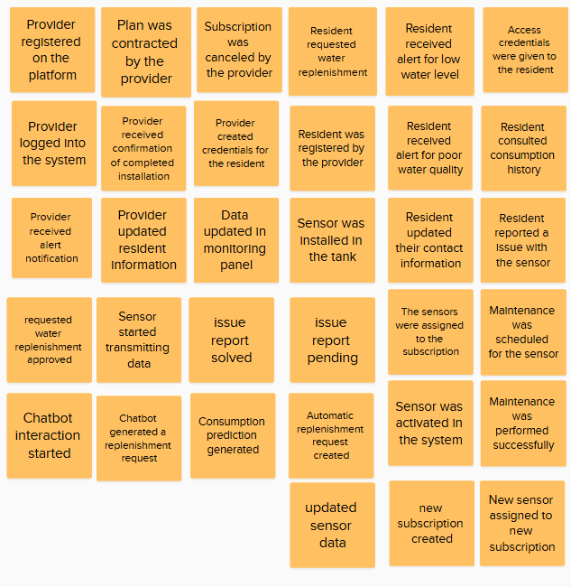

#### 4.2.2. Candidate Context Discovery.

El proceso de Candidate Context Discovery fue ejecutado con el objetivo de establecer una aproximación inicial a los posibles bounded contexts presentes en el dominio. Se aplicó la técnica start-with-value, orientada a identificar los elementos core del dominio que representan el mayor valor estratégico para el negocio. Como resultado de esta exploración, se determinaron los siguientes bounded contexts:

* User & Access Management

  Administra el registro, autenticación y gestión de perfiles de proveedores y residentes. Permite la creación de cuentas, asignación de credenciales y actualización de información personal o de empresa. Garantiza el acceso seguro y controlado al sistema, funcionando como la puerta de entrada para todos los actores.

* Subscriptions

  Gestiona la relación entre residentes, proveedores y sensores. Cada suscripción activa asegura que un tanque de agua cuente con un sensor vinculado y operativo. Controla la creación, cancelación y administración de suscripciones, permitiendo que los proveedores gestionen fácilmente a sus residentes y los sensores asociados.

* Monitoring

  Supervisa y administra los datos provenientes de los sensores instalados en los tanques. Ofrece a los residentes una vista detallada del nivel, calidad y pH del agua en tiempo real, mientras que los proveedores pueden visualizar y gestionar la información de todos sus residentes. También almacena el historial de consumo y genera alertas en caso de anomalías o condiciones críticas.

* Requests

  Centraliza la gestión de solicitudes y reportes de los residentes. Permite generar solicitudes de reabastecimiento de agua y reportes de problemas relacionados con sensores o calidad del recurso. Los proveedores reciben estas solicitudes, actualizan su estado y gestionan la atención correspondiente. Este Bounded Context es clave para coordinar la interacción diaria entre residentes y proveedores.

* Analytics

  Consolida y presenta métricas globales y reportes históricos. Integra información de Monitoring, Subscriptions y Requests para ofrecer un panorama completo del servicio. Los administradores pueden visualizar indicadores como promedios de nivel y calidad del agua, número de solicitudes atendidas y métricas financieras, facilitando decisiones estratégicas y de mejora del servicio.

* Conversational Support

  Habilita la interacción inteligente entre residentes y el sistema a través de un asistente conversacional. Permite consultar el estado del tanque, reportar problemas o solicitar agua usando lenguaje natural. Actúa como interfaz de usuario simplificada y accesible, transformando los mensajes en comandos que se procesan en Requests y Monitoring.

* Predictive Analytics

  Analiza datos históricos y actuales para generar predicciones de consumo y detectar patrones críticos. A partir de estas predicciones, puede emitir alertas preventivas o generar solicitudes automáticas de reabastecimiento. Además, alimenta al módulo de Analytics con métricas de predicción y desempeño del modelo. Representa una capacidad diferenciadora al anticipar la demanda de agua y optimizar la distribución.

#### 4.2.3. Domain Message Flows Modeling.

En esta sección, aplicamos Domain Storytelling para modelar cómo los bounded contexts colaboran mediante flujos de mensajes, resolviendo los casos de uso del negocio. Esta técnica nos permitió visualizar las interacciones entre actores (usuarios, sistemas y servicios), secuenciar los pasos clave y validar el modelo con expertos del dominio. Estos diagramas clarifican dependencias, identifican riesgos y facilitan la alineación entre equipos técnicos y de negocio, asegurando una arquitectura coherente con las necesidades del dominio. 

- **Scenario 1: Habitante revisa el estado del agua de su tanque.**
  
El habitante consulta desde la app móvil el estado de su tanque de agua. El módulo de Monitoring recupera datos del sensor asociado, mostrando nivel, calidad y consumo reciente. Si no hay transmisión, se notifica indisponibilidad. En casos críticos, el sistema genera una alerta preventiva para el usuario.

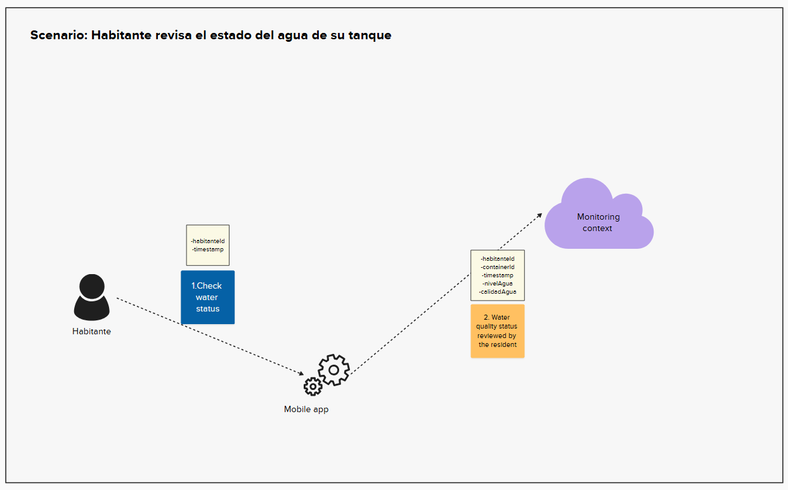

- **Scenario 2:  Proveedor registra y habilita suscripcion de habitante.**
  
El proveedor accede a la plataforma web para registrar a un nuevo habitante. El módulo de User & Profile Management valida y guarda sus datos, y luego el módulo de Subscription crea una nueva suscripción vinculada a un sensor activo. Si el registro falla (datos incompletos o duplicados), se notifica al proveedor para corregirlos antes de habilitar la suscripción.
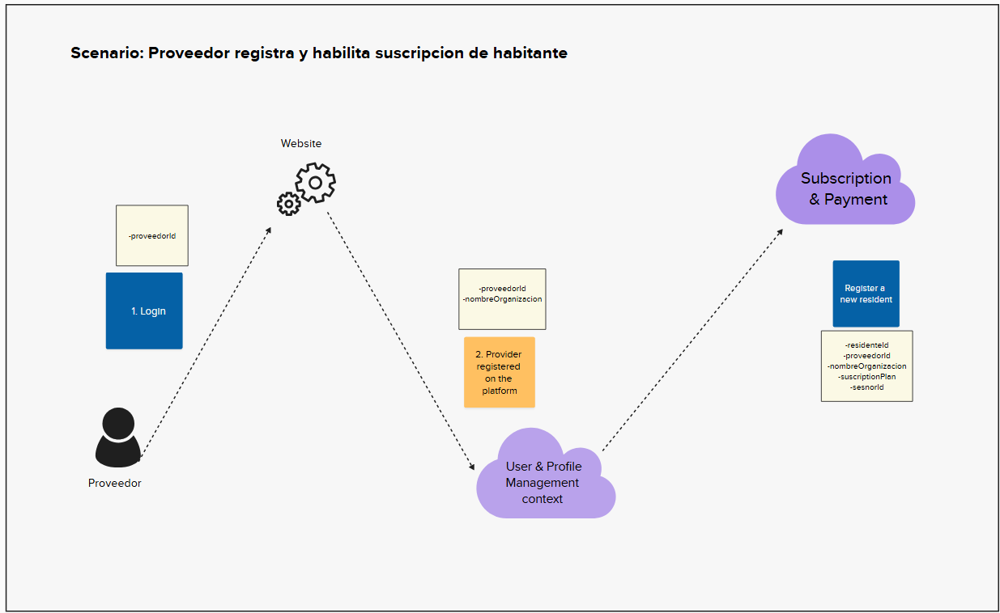
- **Scenario 3: Residente solicita abastecimiento de agua a su proveedor.**

El residente ingresa a la app móvil y crea una solicitud de abastecimiento de agua. El sistema de Requests recibe el pedido y consulta al módulo de User & Profile Management para validar los datos del residente y su suscripción activa. Una vez confirmada la información, la solicitud se registra y queda visible para el proveedor. Si la suscripción no es válida o el residente no tiene sensores activos, la solicitud se rechaza con una notificación en la app.
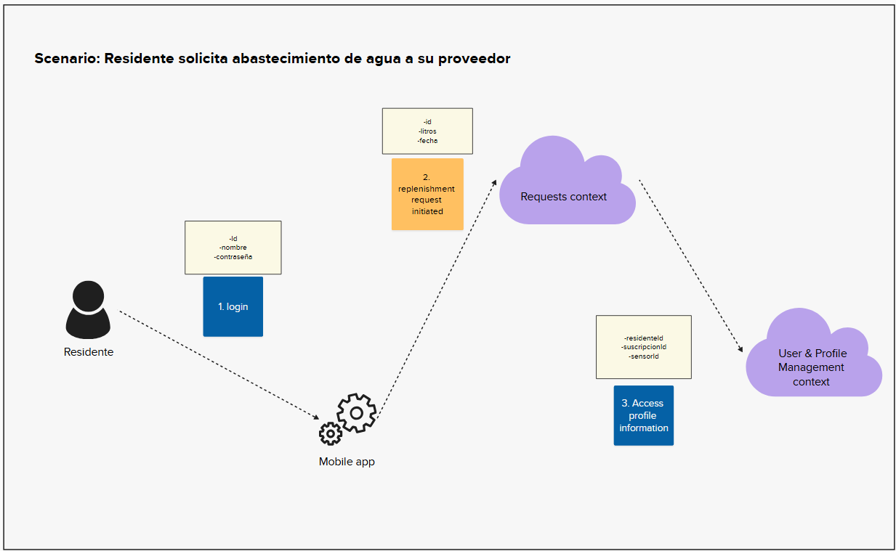
- **Scenario 4: Proveedor consulta predicciones de consumo de su residente y genera reabasteciento.**

El proveedor accede a la plataforma web para consultar el patrón de consumo de un residente. El módulo de Predictive Analytics, utilizando datos históricos de Monitoring, genera una proyección del consumo futuro y estima la fecha en que el tanque alcanzará niveles críticos. Con base en esta información, el proveedor puede decidir generar automáticamente una solicitud de reabastecimiento en el módulo de Requests. Si no existen suficientes datos históricos, el sistema informa que no es posible generar una predicción en ese momento.
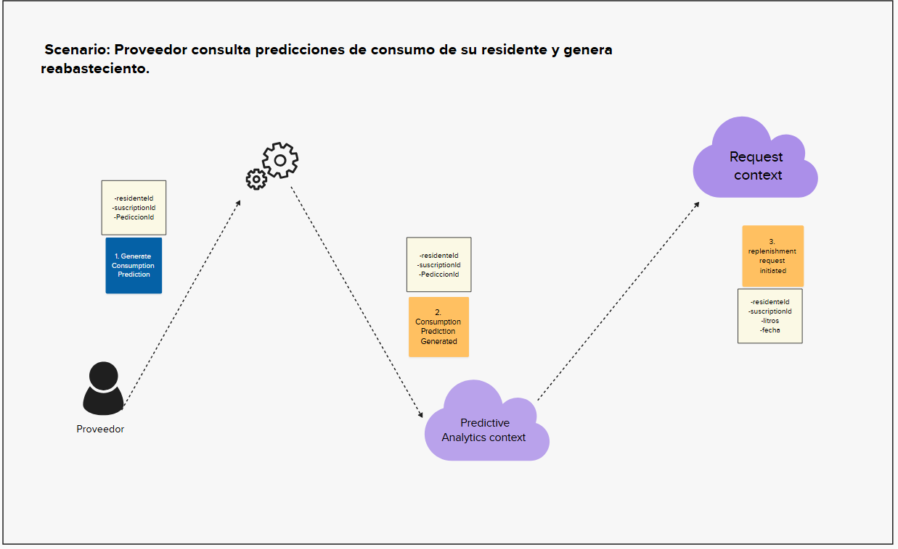

- **Scenario 4: Residente realiza consulta al chatbot.**

El residente accede a la aplicación móvil y abre el chatbot integrado para resolver una consulta sobre el servicio de agua. El chatbot, basado en un modelo de IA conversacional, procesa la pregunta y accede a información del sistema, como su suscripción, historial de consumo o estado de solicitudes, para brindar una respuesta inmediata. Si la consulta excede las capacidades del asistente virtual, el chatbot deriva automáticamente el caso al módulo de Requests, generando un ticket que será atendido por el proveedor.
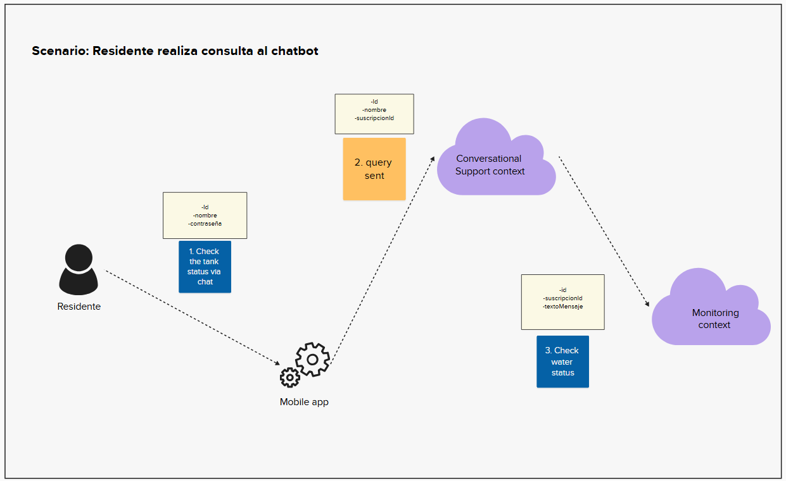

#### 4.2.4. Bounded Context Canvases. 

- Bounded context Subscription & Payment

Este canvas gestiona la creación y administración de suscripciones que vinculan a los residentes con sus sensores y proveedores. Garantiza que cada suscripción esté activa y asociada a un sensor para habilitar el monitoreo del tanque. Las decisiones de negocio incluyen validar que un residente esté registrado antes de generar la suscripción y cancelar automáticamente aquellas que se desactiven por decisión del proveedor o el administrador. El lenguaje ubicuo abarca términos como “Suscripción activa”, “Sensor asignado” y “Estado de suscripción”.

- Bounded context Monitoring

Este canvas administra la captura de datos de los sensores y la visualización en tiempo real del estado del agua. Asegura que residentes y proveedores accedan a métricas actualizadas y que las alertas críticas se emitan sin retrasos. Sus decisiones de negocio incluyen definir intervalos de actualización y enviar notificaciones cuando se superan umbrales de calidad o cantidad. El lenguaje ubicuo incluye “Lectura de sensor”, “Alerta de umbral” e “Historial de consumo”. Las métricas miden precisión de lecturas y latencia de alertas, mientras que las preguntas abiertas tratan sobre protocolos de conectividad y manejo de fallos de sensores.

- Bounded context Analytics

Este canvas se centra en consolidar datos de consumo, calidad y suscripciones en reportes accesibles para el administrador. Garantiza que los reportes reflejen fielmente la operación global del sistema y sirvan para auditorías o decisiones estratégicas. Las decisiones de negocio determinan que solo el administrador puede acceder a métricas agregadas y que los históricos se mantengan disponibles. El lenguaje ubicuo incluye “Reporte de consumo agregado” y “Indicador de calidad promedio”. Sus métricas se enfocan en la frecuencia y exactitud de generación de reportes, mientras que las preguntas abiertas discuten exportación de datos y nivel de detalle requerido.

- Bounded context User & Profile Management

Este canvas regula la autenticación, registro y mantenimiento de perfiles de residentes y proveedores. Asegura que el acceso al sistema sea seguro y que cada usuario gestione sus propios datos. Sus decisiones de negocio incluyen exigir credenciales únicas, restringir cambios de perfil a usuarios legítimos y verificar a los proveedores antes de permitirles registrar residentes. El lenguaje ubicuo abarca “Credenciales de acceso” y “Perfil de usuario”. Las métricas incluyen tasas de registro exitoso y accesos fallidos, y las preguntas abiertas se centran en posibles integraciones con sistemas externos de autenticación o gestión de fraudes.

- Bounded context Requests

Este canvas administra las solicitudes de reabastecimiento y reportes de problemas generados por residentes. Asegura que los proveedores tengan un canal transparente para gestionar dichas solicitudes y mantener informados a los usuarios. Las decisiones de negocio incluyen vincular cada request a una suscripción activa y exigir a los proveedores que actualicen su estado. El lenguaje ubicuo usa términos como “Solicitud de agua” y “Estado de request”. Las métricas miden tiempos de respuesta y tasas de resolución, mientras que las preguntas abiertas se centran en mecanismos de priorización y notificación automática.

- Bounded context Predictive Analytics

Este canvas analiza datos históricos de consumo para generar predicciones sobre futuros niveles de agua. Permite a los proveedores anticipar necesidades de reabastecimiento y evitar desabastecimientos. Las decisiones de negocio establecen que toda predicción se base en datos recientes y requiera validación humana antes de ejecutar acciones. El lenguaje ubicuo incluye “Predicción de consumo” y “Estimación de desabastecimiento”. Sus métricas evalúan precisión y rapidez de las predicciones, y las preguntas abiertas abarcan el horizonte temporal del modelo y el tipo de técnicas de análisis a usar.

- Bounded context Conversational Support

Este canvas integra un asistente conversacional para responder dudas frecuentes de residentes y derivar consultas complejas a Requests. Su objetivo es mejorar la experiencia de usuario con atención inmediata. Las decisiones de negocio definen que el chatbot debe resolver un alto porcentaje de consultas frecuentes y registrar tickets automáticamente en casos no cubiertos. El lenguaje ubicuo incluye “Consulta automática” y “Derivación de ticket”. Las métricas consideran porcentaje de consultas resueltas y tiempos de respuesta, mientras que las preguntas abiertas discuten el uso de modelos propios o externos y el soporte multilingüe.

### 4.2.5. Context Mapping.

En este diagrama se visualiza las relaciones clave entre los bounded contexts del sistema.

### 4.3. Software Architecture.

#### 4.3.1. Software Architecture System Landscape Diagram.

#### 4.3.2. Software Architecture Context Level Diagrams.

En el diagrama de contexto se observa que el Proveedor gestiona usuarios y sensores a través de la plataforma web, el Administrador supervisa operaciones globales como aprobación de solicitudes y asignación de planes, y los Residentes reciben alertas y monitorean el consumo mediante una aplicación móvil. El sistema central AquaConecta se integra con Mercado Pago para procesar pagos y con los dispositivos hardware IoT, que capturan y transmiten datos de nivel y calidad del agua.

#### 4.3.3. Software Architecture Container Level Diagrams.

El diagrama de contenedores muestra cómo interactúan los distintos usuarios y componentes del sistema. Los usuarios incluyen: residentes (que usan una app móvil para monitorear consumo y recibir alertas), proveedores (que gestionan sensores desde una plataforma web) y administradores (que configuran y supervisan el sistema). En el núcleo, el hardware AquaConecta mide calidad y nivel del agua, enviando datos a una app embebida que los recolecta. Luego, la Edge Processing App analiza la información y la guarda en una base SQLite. Una API REST en Spring Boot conecta las aplicaciones con una base de datos MySQL centralizada. La app móvil permite a los residentes interactuar, mientras que la web permite gestionar sensores, usuarios y planes. Además, el sistema se integra con Mercado Pago para gestionar pagos de servicios.

#### 4.3.4. Software Architecture Deployment Diagrams.

El diagrama de despliegue muestra cómo se distribuyen los distintos componentes de software en su entorno de ejecución. El sistema está compuesto por una aplicación web desarrollada con Angular y una aplicación móvil desarrollada con Flutter, ambas desplegadas sobre Firebase. Estas aplicaciones se comunican mediante JSON/HTTPS con una API REST construida con Spring Boot (Java), que encapsula toda la lógica de negocio organizada por contextos delimitados. La API, a su vez, realiza operaciones de lectura y escritura sobre una base de datos MySQL, que almacena información de usuarios, suscripciones, sensores, alertas y registros administrativos. Además, el backend se integra con el sistema de pagos externo Mercado Pago, utilizado para procesar transacciones.

## Conclusiones
### Conclusiones – TB1

Durante esta primera etapa se realizó una investigación contextual que permitió comprender el entorno y las condiciones en las que se desarrollará la solución. Esto facilitó una visión más precisa de los desafíos y oportunidades del proyecto.

Se identificaron de manera clara las necesidades de los usuarios y del mercado objetivo, lo que sirvió como base para definir los alcances y objetivos principales de la solución propuesta.

A partir de ese análisis, se formuló una propuesta de valor alineada con los problemas detectados, enfocada en brindar una solución práctica y efectiva.

También se elaboró un diseño preliminar de la arquitectura del sistema, estableciendo una guía estructural que orientará el desarrollo técnico en las siguientes fases.

El equipo logró consolidar una visión compartida del funcionamiento general de la aplicación, lo cual facilitará la toma de decisiones y el trabajo colaborativo.

En conjunto, estas acciones sentaron las bases estratégicas para un desarrollo ordenado y coherente en las futuras entregas del proyecto.

# Bibliografía

## Referencias

- Infobae. (2024, septiembre 8). *Alarma por la falta de acceso continuo a agua potable en Ica: solo el 13.3% de los hogares cuenta con el servicio las 24 horas*. Infobae. [https://www.infobae.com/peru/2024/09/08/alarma-por-la-falta-de-acceso-continuo-a-agua-potable-en-ica-solo-el-133-de-los-hogares-cuenta-con-el-servicio-las-24-horas/](https://www.infobae.com/peru/2024/09/08/alarma-por-la-falta-de-acceso-continuo-a-agua-potable-en-ica-solo-el-133-de-los-hogares-cuenta-con-el-servicio-las-24-horas/)

- Diario Correo (2024). Asentamiento humano 28 de Julio queda sin agua potable durante varios días consecutivos. Diario Correo.   https://diariocorreo.pe/edicion/ica/chincha-miles-de-familias-padecen-por-falta-de-agua-hasta-por-una-semana-noticia/?ref=dcr#google_vignette

- Diario Correo (2025). Pobladores de Chincha protestan por deficiente servicio de agua de SEMAPACH. Diario Correo.   https://diariocorreo.pe/edicion/ica/chincha-planton-contra-semapach-por-mejor-servicio-de-agua-potable-noticia/?ref=dcr

- Superintendencia Nacional de Servicios de Saneamiento (Sunass). (2025, febrero 28). *Sunass monitorea abastecimiento y continuidad del agua potable en más de 200 colegios de Ica*. Gobierno del Perú. [https://www.gob.pe/institucion/sunass/noticias/1118140-sunass-monitorea-abastecimiento-y-continuidad-del-agua-potable-en-mas-de-200-colegios-de-ica](https://www.gob.pe/institucion/sunass/noticias/1118140-sunass-monitorea-abastecimiento-y-continuidad-del-agua-potable-en-mas-de-200-colegios-de-ica)

- Superintendencia Nacional de Servicios de Saneamiento (Sunass). (2025, enero 10). *Sunass fiscaliza a Semapach ante interrupción del servicio de agua potable en Chincha*. Gobierno del Perú. [https://www.gob.pe/institucion/sunass/noticias/886137-ica-sunass-fiscaliza-a-semapach-ante-interrupcion-del-servicio-de-agua-potable-en-chincha](https://www.gob.pe/institucion/sunass/noticias/886137-ica-sunass-fiscaliza-a-semapach-ante-interrupcion-del-servicio-de-agua-potable-en-chincha)

- Infobae. (2024, mayo 9). *El 73.7% de peruanos no tiene acceso a agua de manera segura, según INEI*. Infobae. [https://www.infobae.com/peru/2024/05/09/el-737-de-peruanos-no-tiene-acceso-a-agua-de-manera-segura-segun-inei/](https://www.infobae.com/peru/2024/05/09/el-737-de-peruanos-no-tiene-acceso-a-agua-de-manera-segura-segun-inei/)

